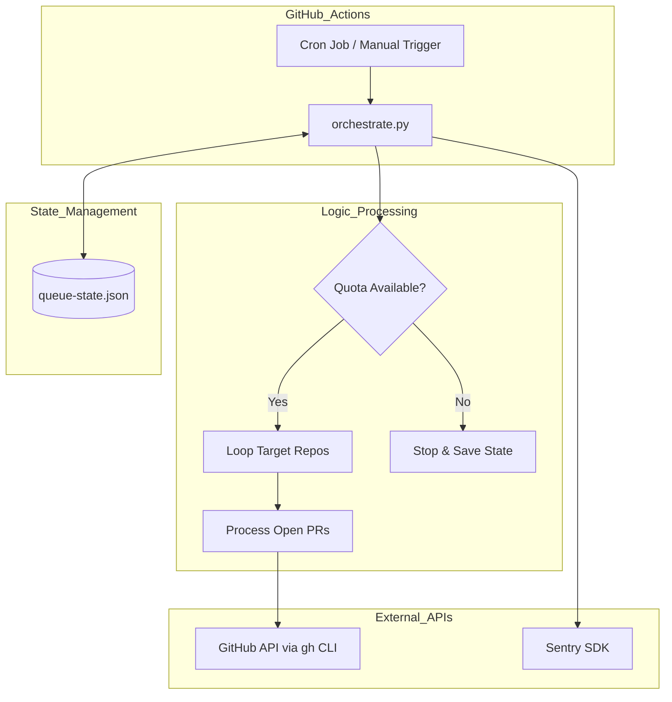
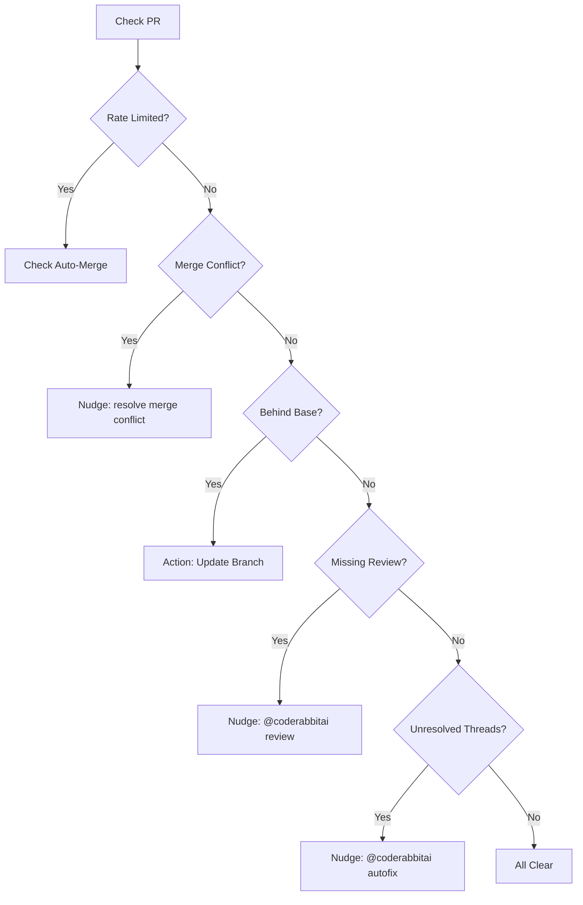

<details>
<summary>Relevant source files</summary>

The following files were used as context for generating this wiki page:

- [README.md](README.md)
- [orchestrate.py](orchestrate.py)
- [queue-state.json](queue-state.json)
- [requirements.txt](requirements.txt)
- [.github/workflows/orchestrate.yml](README.md) (Referenced in README documentation)
</details>

# Introduction to CodeRabbit Queue

The CodeRabbit Queue is a central, account-wide orchestrator designed to manage and nudge the CodeRabbit AI (`@coderabbitai`) across multiple GitHub repositories. Its primary purpose is to circumvent gridlock caused by CodeRabbit's account-wide review quota (5 reviews per hour) by consolidating multiple independent repository workflows into a single, state-aware management system.
Sources: [README.md:1-12](README.md#L1-L12), [orchestrate.py:5-15](orchestrate.py#L5-L15)

This system ensures that 16 specific target repositories receive timely reviews and resolutions without exceeding the shared API limits. It manages the lifecycle of a Pull Request (PR) by identifying merge conflicts, missing reviews, and unresolved threads, while enforcing strict cooldown periods and escalation paths.
Sources: [README.md:14-25](README.md#L14-L25), [orchestrate.py:45-62](orchestrate.py#L45-L62)

## System Architecture

The architecture consists of a Python-based orchestrator script triggered by a GitHub Action cron job. It utilizes the GitHub CLI (`gh`) to interact with the GitHub API and maintains a local JSON file to persist state between runs.



The diagram shows the execution flow from the trigger through quota checking, repository processing, and state persistence.
Sources: [README.md:14-25](README.md#L14-L25), [orchestrate.py:530-575](orchestrate.py#L530-L575)

## Quota and Rate Limit Management

The orchestrator enforces a conservative budget to stay within CodeRabbit's limits. It uses a "rolling window" approach and real-time comment scanning to detect actual rate limits.
Sources: [orchestrate.py:65-68](orchestrate.py#L65-L68), [orchestrate.py:168-185](orchestrate.py#L168-L185)

### Configuration Constants
| Constant | Value | Description |
| :--- | :--- | :--- |
| `QUOTA_PER_HOUR` | 4 | Safety margin under the real 5/hour cap |
| `QUOTA_WINDOW_MINUTES` | 60 | The rolling window duration |
| `PER_PR_COOLDOWN_MINUTES`| 20 | Minimum time between nudging the same PR |
| `MAX_AUTOFIX_ATTEMPTS` | 2 | Limit for AI-assisted code fixes |
| `MAX_MERGE_CONFLICT_ATTEMPTS`| 2 | Limit for automated conflict resolution |
Sources: [orchestrate.py:65-72](orchestrate.py#L65-L72)

### Rate Limit Detection
The system scans PR comments for the pattern `more reviews will be available in (\d+)\s*(minute|hour)s?`. If found, it sets a `rate_limited_until` timestamp in the state file, halting all review-related nudges until the deadline passes.
Sources: [orchestrate.py:101-104](orchestrate.py#L101-L104), [orchestrate.py:171-185](orchestrate.py#L171-L185)

## PR Processing Logic

The orchestrator evaluates each PR against a priority-based decision tree. If a nudge is sent, it is recorded in `queue-state.json` to consume the internal quota.
Sources: [orchestrate.py:382-525](orchestrate.py#L382-L525)



This flowchart illustrates the hierarchical priority logic used to determine the next action for any given PR.
Sources: [orchestrate.py:382-525](orchestrate.py#L382-L525), [README.md:18-20](README.md#L18-L20)

### Escalation Path
When automated nudges fail to resolve issues after reaching defined limits (e.g., `MAX_AUTOFIX_ATTEMPTS`), the system escalates the PR by adding the `ask-claude` label. This prevents infinite loops and ensures human or higher-tier AI intervention.
Sources: [orchestrate.py:70-74](orchestrate.py#L70-L74), [orchestrate.py:339-354](orchestrate.py#L339-L354)

## Data Model (queue-state.json)

The `queue-state.json` file tracks both global activity and specific PR history.

### State Schema
- `nudges`: A list of objects containing `ts` (timestamp), `repo`, `pr`, and `type` (e.g., "review", "autofix", "resolve").
- `prs`: A dictionary keyed by `owner/repo#number` containing:
  - `last_attempt`: ISO timestamp of the last action.
  - `autofix_attempts`: Counter for autofix nudges.
  - `merge_conflict_attempts`: Counter for conflict resolution nudges.
  - `escalated_to_claude`: Boolean flag.
- `rate_limited_until`: Global timestamp for account-wide backoff.
Sources: [orchestrate.py:108-115](orchestrate.py#L108-L115), [queue-state.json:1-125](queue-state.json#L1-L125)

```json
{
  "nudges": [
    {
      "pr": 183,
      "repo": "bastion",
      "ts": "2026-07-20T05:50:54.051301+00:00",
      "type": "resolve"
    }
  ],
  "prs": {
    "blixten85/bastion#183": {
      "autofix_attempts": 2,
      "last_attempt": "2026-07-20T05:50:54.051301+00:00",
      "resolve_attempts": 1
    }
  }
}
```

Sources: [queue-state.json:2-10](queue-state.json#L2-L10), [queue-state.json:52-56](queue-state.json#L52-L56)

## Integrated Services

The orchestrator supports multiple AI bots and monitoring tools:
- **CodeRabbit**: Primary reviewer and autofix provider.
- **Cubic Dev AI**: Handled specifically for branch-based fixes and transient error retries (scans for "cubic command failed").
- **Sentry Seer**: Scanned via `has_sentry_check` to ensure security reviews are triggered.
- **Sentry SDK**: Provides error tracking and performance monitoring for the orchestration script itself.
Sources: [orchestrate.py:34-44](orchestrate.py#L34-L44), [orchestrate.py:84-95](orchestrate.py#L84-L95), [orchestrate.py:188-201](orchestrate.py#L188-L201), [orchestrate.py:284-292](orchestrate.py#L284-L292)

## Summary
The CodeRabbit Queue transforms fragmented repository management into a centralized, quota-aware system. By enforcing cooldowns, tracking attempts, and detecting actual rate limits via comment analysis, it ensures the `blixten85` GitHub account maintains a steady flow of AI reviews without triggering account-wide lockouts.
Sources: [README.md:8-13](README.md#L8-L13), [orchestrate.py:7-15](orchestrate.py#L7-L15)
