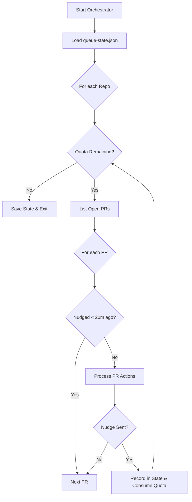

<details>
<summary>Relevant source files</summary>

The following files were used as context for generating this wiki page:

- [README.md](README.md)
- [orchestrate.py](orchestrate.py)
- [queue-state.json](queue-state.json)
- [requirements.txt](requirements.txt)
- [.github/workflows/orchestrate.yml](README.md) (Referenced in README)

</details>

# The Review Quota Problem

The Review Quota Problem refers to a critical gridlock scenario where multiple GitHub repositories independently triggered CodeRabbit reviews, exceeding the account-wide limit of 5 reviews per hour. Because individual repositories lacked visibility into the activity of others, their workflows would simultaneously exhaust the shared quota, preventing any repository from receiving a successful review.

This system replaces decentralized workflows with a central orchestrator that manages a shared budget and prioritizes pull request (PR) actions. It ensures that reviews are distributed across 16 target repositories without hitting the hard limits imposed by CodeRabbit's AI service.

Sources: [README.md:9-16](README.md#L9-L16), [orchestrate.py:5-15](orchestrate.py#L5-L15)

## Architectural Overview

The solution transitions from a per-repo push model to a centralized pull-and-schedule model. A single cron job executes the `orchestrate.py` script, which evaluates all open PRs against a local state file and a global quota.

### System Components

- **The Orchestrator (`orchestrate.py`):** The logic engine that iterates through repositories, fetches PR details, and executes commands.
- **State Ledger (`queue-state.json`):** A persistent JSON file tracking nudge timestamps, PR-specific attempt counters, and account-wide rate-limit status.
- **GitHub CLI (`gh`):** The primary interface for interacting with the GitHub API to list PRs, post comments, and edit labels.
- **Sentry SDK:** Integrated for error tracking and performance profiling of the orchestration runs.

Sources: [orchestrate.py:18-45](orchestrate.py#L18-L45), [orchestrate.py:166-180](orchestrate.py#L166-L180), [requirements.txt:1](requirements.txt#L1)

### Data Flow and Decision Logic

The following diagram illustrates how the orchestrator decides whether to send a "nudge" (an AI command) to a pull request.



The logic prioritizes recovery actions (merge conflicts) over standard reviews.
Sources: [orchestrate.py:465-515](orchestrate.py#L465-L515), [README.md:19-27](README.md#L19-L27)

## Quota Management and Safety Margins

To avoid gridlock, the system enforces a strict internal budget that is more conservative than the actual API limits.

### Configuration Constants

| Constant | Value | Description |
| :--- | :--- | :--- |
| `QUOTA_PER_HOUR` | 4 | Number of nudges allowed per rolling 60 minutes (Safety margin under the real 5/hour limit). |
| `QUOTA_WINDOW_MINUTES` | 60 | The rolling window duration for quota calculation. |
| `PER_PR_COOLDOWN_MINUTES` | 20 | Minimum time between nudges on the same PR to prevent spam. |
| `MAX_AUTOFIX_ATTEMPTS` | 2 | Maximum attempts to request an automated code fix. |
| `MAX_MERGE_CONFLICT_ATTEMPTS`| 2 | Maximum attempts to resolve merge conflicts before escalating. |

Sources: [orchestrate.py:65-71](orchestrate.py#L65-L71)

### Rate Limit Detection

The system does not just guess the quota; it actively scans CodeRabbit's comments for authoritative rate-limit messages. If CodeRabbit responds with a message like "...More reviews will be available in 21 minutes," the orchestrator records this in the `rate_limited_until` field of the state file and pauses all review-related nudges until the deadline passes.

Sources: [orchestrate.py:100-105](orchestrate.py#L100-L105), [orchestrate.py:151-165](orchestrate.py#L151-L165)

## Action Prioritization and Escalation

When a PR is processed, the orchestrator evaluates its state and chooses exactly one action based on the following hierarchy:

### 1. Merge Conflicts
If a PR has a `CONFLICTING` mergeable status, the system sends `@coderabbitai resolve merge conflict`. If this fails after `MAX_MERGE_CONFLICT_ATTEMPTS`, the PR is escalated to a human/Claude review.
Sources: [orchestrate.py:382-398](orchestrate.py#L382-L398)

### 2. Branch Maintenance
If the PR branch is `BEHIND` the base branch, the orchestrator triggers a GitHub API call to update the branch (merging base into head). This is treated as a nudge because it triggers a new CodeRabbit review.
Sources: [orchestrate.py:403-410](orchestrate.py#L403-L410)

### 3. Missing Reviews
If no CodeRabbit or Sentry (Seer) checks/comments are present, the system requests a review using `@coderabbitai review` or `@sentry review`.
Sources: [orchestrate.py:412-424](orchestrate.py#L412-L424)

### 4. Unresolved Threads and Autofix
The system differentiates between different AI bots. It identifies which bot owns an unresolved thread and sends the specific autofix command (e.g., `@cubic-dev-ai fix this issue...`).
Sources: [orchestrate.py:426-455](orchestrate.py#L426-L455)

### 5. Escalation to Claude
If all automated attempts (autofix and resolve) are exhausted, the orchestrator adds the `ask-claude` label to the PR. This is a one-way, one-time escalation to prevent infinite loops and excessive costs.
Sources: [orchestrate.py:328-341](orchestrate.py#L328-L341), [orchestrate.py:468-473](orchestrate.py#L468-L473)

## State Schema

The `queue-state.json` file serves as the centralized memory for the orchestrator.

```json
{
  "nudges": [
    {
      "ts": "ISO-8601 Timestamp",
      "repo": "string",
      "pr": "integer",
      "type": "string"
    }
  ],
  "prs": {
    "owner/repo#number": {
      "last_attempt": "timestamp",
      "autofix_attempts": "integer",
      "escalated_to_claude": "boolean"
    }
  },
  "rate_limited_until": "timestamp or null"
}
```

Sources: [queue-state.json:1-60](queue-state.json#L1-L60), [orchestrate.py:84-115](orchestrate.py#L84-L115)

## Summary

The Review Quota Problem is resolved by centralizing state and enforcing account-wide constraints. By implementing a rolling 60-minute ledger and per-PR cooldowns, the orchestrator prevents the parallel execution of 16 repository workflows from saturating CodeRabbit's limits. The system also provides a robust fallback mechanism, escalating to Claude or marking threads as resolved when automated fixes fail to progress, ensuring pull requests do not remain stuck in perpetuity.

Sources: [README.md:29-35](README.md#L29-L35), [orchestrate.py:530-540](orchestrate.py#L530-L540)
