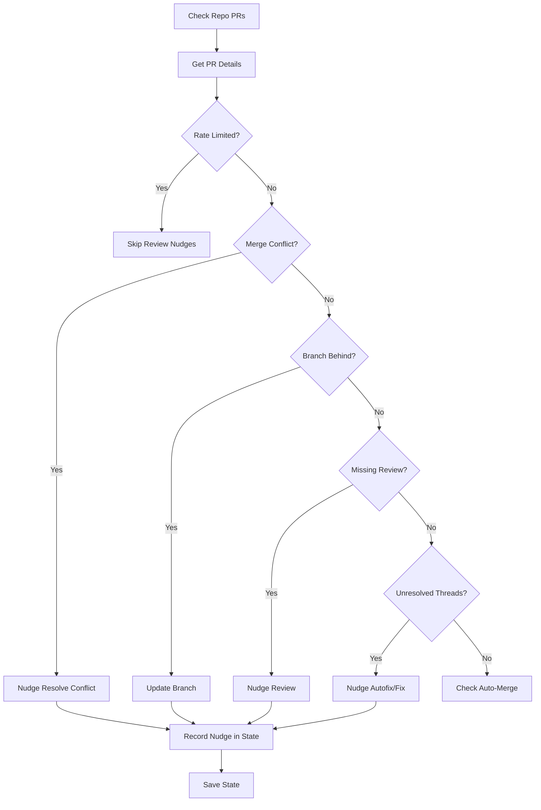
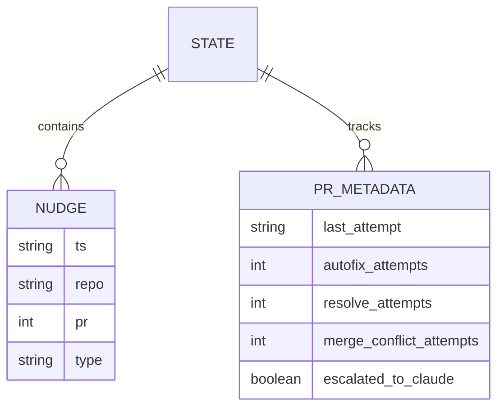

Relevant source files

The following files were used as context for generating this wiki page:

- [README.md](README.md)
- [orchestrate.py](orchestrate.py)
- [queue-state.json](queue-state.json)
- [requirements.txt](requirements.txt)
- [.github/workflows/orchestrate.yml](README.md) (Referenced via README)

# Managed Target Repositories

Managed Target Repositories are a collection of GitHub repositories under the `blixten85` account that are centrally monitored and managed by the CodeRabbit Queue orchestrator. The orchestrator's primary function is to manage pull request (PR) reviews and nudges across these repositories while adhering to a shared account-wide quota of 5 reviews per hour, effectively preventing the gridlock that occurred when each repository operated independent workflows.

Sources: [README.md:3-13](README.md#L3-L13), [orchestrate.py:10-18](orchestrate.py#L10-L18)

The system replaces legacy per-repo `coderabbit-rewake.yml` workflows with a single cron job that iterates through a hardcoded list of target repositories to ensure efficient use of CodeRabbit resources and provide a single source of truth for nudging logic.

Sources: [README.md:15-28](README.md#L15-L28), [orchestrate.py:46-63](orchestrate.py#L46-L63)

## Inventory of Managed Repositories

The system manages a specific set of 16 repositories. These are defined within the `REPOS` list in the orchestration logic.

| Repository Name | Description / Context |
| :--- | :--- |
| `bastion` | Core infrastructure or gateway service |
| `scraper` | Data collection utility |
| `routines-relay` | Relay service for routine tasks |
| `ops-hub` | Operations management portal |
| `product-describer` | Content generation service |
| `docker-idempotent-update` | Deployment utility |
| `plex_clear_watchlist` | Media management utility |
| `pastebinit` | Code sharing tool |
| `politiker-kontakter` | Contact management system |
| `politiker-webapp` | Web application |
| `filtered-movies` | Content filtering service |
| `product-describer-cloudflare` | Cloudflare-specific content service |
| `repo-standard` | Repository standardization tools |
| `bastion-certificates` | Certificate management |
| `renovate-runner` | Dependency update runner |
| `secrets-rotation` | Security management |

Sources: [README.md:30-36](README.md#L30-L36), [orchestrate.py:46-63](orchestrate.py#L46-L63), [queue-state.json:11-205](queue-state.json#L11-L205)

## Orchestration Logic and Data Flow

The orchestrator processes each repository sequentially. For every open pull request discovered, it evaluates the current state against predefined priorities to determine the next action.

### Processing Pipeline

The following diagram illustrates the decision-making process for a pull request within a managed repository:

The logic prioritizes merge conflicts first, followed by branch updates, missing initial reviews, and finally resolving individual comment threads.

Sources: [orchestrate.py:417-535](orchestrate.py#L417-L535), [README.md:20-22](README.md#L20-L22)

### Global Quota Management

Because CodeRabbit enforces an account-wide limit, the orchestrator tracks every nudge sent to any managed repository in a shared `queue-state.json` file. 

*  **Hourly Budget:** Enforces a limit of 4 nudges per rolling 60 minutes (a safety margin below the 5/hour limit).
*  **Cooldown:** A 20-minute per-PR cooldown prevents hammering the same PR in rapid succession.
*  **State Persistence:** The state is committed back to the repository after each run to ensure continuity across GitHub Action invocations.

Sources: [orchestrate.py:65-68](orchestrate.py#L65-L68), [README.md:23-26](README.md#L23-L26)

## State Tracking and Escalation

The `queue-state.json` file acts as the database for all managed repositories, tracking attempts and escalation status for each PR.

### Data Schema
The state file maps repository-specific PRs to their current metadata, including attempt counters for different nudge types.

Sources: [queue-state.json:1-210](queue-state.json#L1-L210), [orchestrate.py:118-124](orchestrate.py#L118-L124)

### Escalation Path
When standard nudges fail to resolve issues in a managed repository, the orchestrator follows an escalation path to prevent infinite loops:
1.  **Autofix:** Attempted up to `MAX_AUTOFIX_ATTEMPTS` (default 2).
2.  **Resolve:** Fallback to `@coderabbitai resolve` attempted once.
3.  **Claude Escalation:** If threads remain unresolved or conflicts persist, the repository is flagged with the `ask-claude` label, and the orchestrator ceases further nudges for that PR.

Sources: [orchestrate.py:69-72](orchestrate.py#L69-L72), [orchestrate.py:382-398](orchestrate.py#L382-L398), [orchestrate.py:514-531](orchestrate.py#L514-L531)

## Summary

Managed Target Repositories transition from fragmented, independent automation to a unified, quota-aware system. By centralizing the orchestration of 16 repositories, the project ensures that CodeRabbit reviews are distributed efficiently without exceeding API limits, while providing clear escalation paths for complex merge conflicts and unresolved code reviews.

Sources: [README.md:5-28](README.md#L5-L28), [orchestrate.py:10-25](orchestrate.py#L10-L25)
