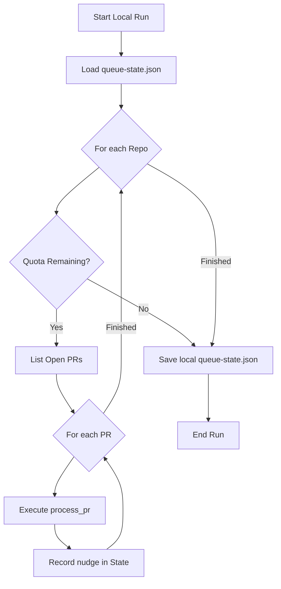
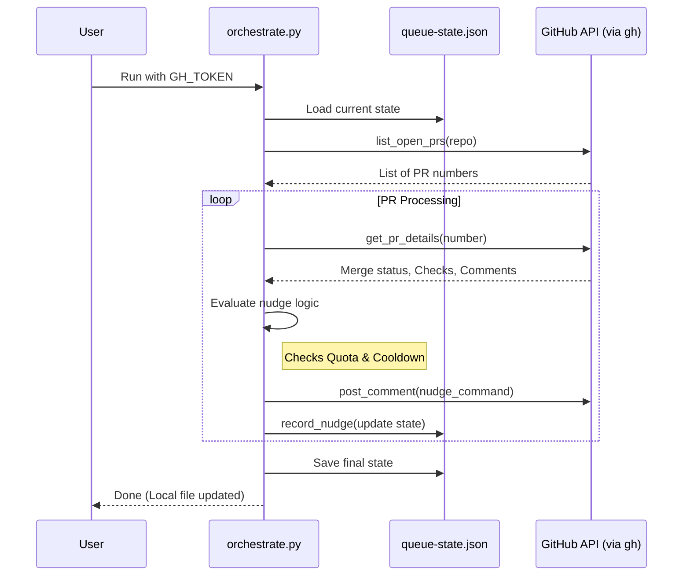

<details>
<summary>Relevant source files</summary>

The following files were used as context for generating this wiki page:

- [README.md](README.md)
- [orchestrate.py](orchestrate.py)
- [queue-state.json](queue-state.json)
- [requirements.txt](requirements.txt)
- [.github/workflows/orchestrate.yml](.github/workflows/orchestrate.yml) (referenced in documentation)
</details>

# Running the Orchestrator Locally

The CodeRabbit Queue Orchestrator is designed to manage and prioritize AI-driven code reviews across multiple repositories while staying within API rate limits. While primarily executed via GitHub Actions, running the orchestrator locally allows developers to manually trigger the queue logic, debug state transitions, or verify configuration changes against the defined target repositories.

Local execution relies on a Python environment and the GitHub CLI (`gh`) to interact with the GitHub API. When run locally, the script reads from and writes to a local `queue-state.json` file to track nudges and rate limits, but unlike the CI environment, it does not automatically commit these state changes back to the repository.

Sources: [README.md:38-42](README.md#L38-L42), [orchestrate.py:10-20](orchestrate.py#L10-L20)

## Prerequisites and Environment Setup

Before running the orchestrator locally, the environment must be configured with the necessary dependencies and authentication tokens.

### System Requirements
*  **Python 3.x**: The core logic is implemented in Python.
*  **GitHub CLI (`gh`)**: The script uses `subprocess` to call `gh` and `gh api` for repository interactions.
*  **Authentication Token**: A personal access token (PAT) with `Pull requests: read/write` permissions across all target repositories is required. This is passed via the `GH_TOKEN` environment variable.

### Dependency Installation
The project requires the `sentry-sdk` for error tracking and performance monitoring.

```bash
pip install -r requirements.txt
```

Sources: [requirements.txt:1](requirements.txt#L1), [orchestrate.py:25-37](orchestrate.py#L25-L37), [README.md:40-42](README.md#L40-L42)

## Execution Workflow

Running the orchestrator locally follows a specific command structure. The script will iterate through the hardcoded `REPOS` list and process open pull requests.

### Execution Command
To start the orchestrator locally, use the following command:

```bash
GH_TOKEN=<your_token> python3 orchestrate.py
```

Sources: [README.md:46](README.md#L46)

### Execution Logic Flow
The orchestrator performs a sequential scan of repositories and pull requests, checking against global and per-PR constraints.



The logic ensures that the script stops immediately if the `QUOTA_PER_HOUR` (defaulting to 4) is reached to prevent account-wide gridlock.

Sources: [orchestrate.py:536-580](orchestrate.py#L536-L580), [README.md:20-25](README.md#L20-L25)

## State Management and Configuration

The orchestrator relies on local configuration constants and a JSON state file to persist data between runs.

### Local State File (`queue-state.json`)
When running locally, the script interacts with `queue-state.json` in the current working directory. This file tracks:
*  **Nudges**: A list of recent actions with timestamps to calculate rolling window quotas.
*  **PR Metadata**: Tracks attempts for autofixes, merge conflict resolutions, and escalations.
*  **Rate Limits**: Stores authoritative backoff timestamps if CodeRabbit signals a rate limit in a PR comment.

Sources: [orchestrate.py:102-120](orchestrate.py#L102-L120), [queue-state.json:1-10](queue-state.json#L1-L10)

### Key Configuration Constants
These values are hardcoded in `orchestrate.py` and govern the behavior of the local run:

| Constant | Value | Description |
| :--- | :--- | :--- |
| `QUOTA_PER_HOUR` | 4 | Max nudges allowed per rolling 60 minutes. |
| `QUOTA_WINDOW_MINUTES` | 60 | The timeframe for the rolling quota window. |
| `PER_PR_COOLDOWN_MINUTES` | 20 | Minimum time between nudges for a specific PR. |
| `MAX_AUTOFIX_ATTEMPTS` | 2 | Max times to try `@coderabbitai autofix` before falling back. |
| `MAX_MERGE_CONFLICT_ATTEMPTS` | 2 | Max times to nudge merge conflict resolution. |

Sources: [orchestrate.py:75-85](orchestrate.py#L75-L85)

## Technical Architecture

The local orchestrator functions as a state machine that transitions pull requests through different "nudge" states based on their current GitHub status.

### Component Interaction Diagram
The following diagram illustrates how the local script interacts with the file system and external APIs.



Sources: [orchestrate.py:461-534](orchestrate.py#L461-L534), [README.md:40-48](README.md#L40-L48)

## Conclusion

Running the orchestrator locally provides a manual interface for the CodeRabbit queue management system. It utilizes the same logic as the automated GitHub Action but allows for direct observation of the `queue-state.json` transitions. Users must ensure a valid `GH_TOKEN` is provided and be aware that local runs will consume the shared account-wide quota of 4 nudges per hour.

Sources: [README.md:15-25](README.md#L15-L25), [orchestrate.py:7-18](orchestrate.py#L7-L18)
