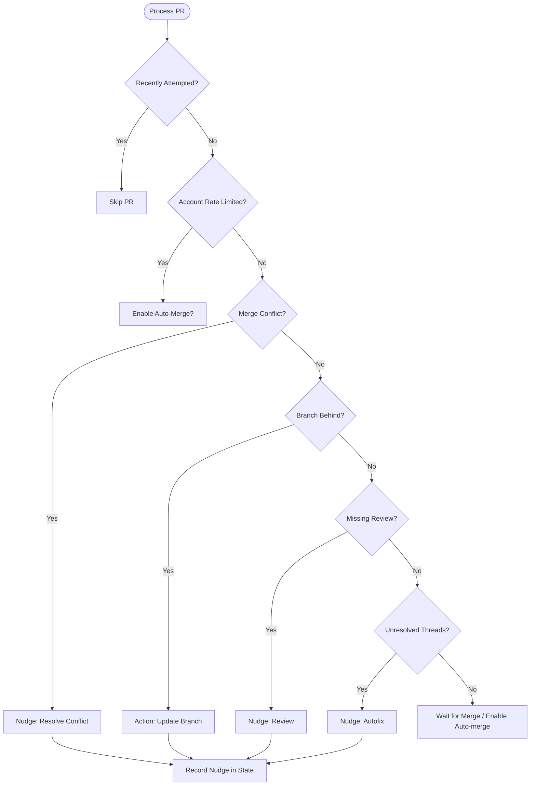
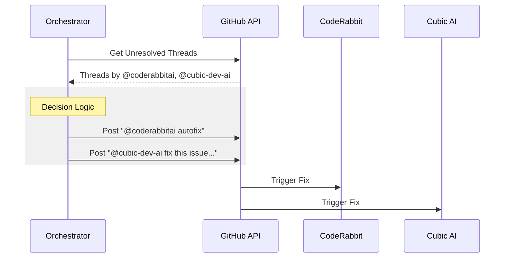

Relevant source files

The following files were used as context for generating this wiki page:

- [README.md](README.md)
- [orchestrate.py](orchestrate.py)
- [queue-state.json](queue-state.json)
- [requirements.txt](requirements.txt)
- [.github/workflows/orchestrate.yml](README.md) (Inferred from documentation)

# Migrating from Per-Repo Workflows

## Introduction
The migration from per-repo workflows to a centralized orchestrator addresses a critical limitation in how CodeRabbit reviews are triggered. Previously, each repository maintained an independent `coderabbit-rewake.yml` workflow. Because CodeRabbit enforces an account-wide quota of 5 reviews per hour, these isolated workflows often operated in parallel, exhausting the quota and causing a system-wide gridlock where no repository could receive a review.

The new centralized system replaces these individual workflows with a single cron job located in the `coderabbit-queue` repository. This orchestrator provides global visibility across all managed repositories, ensuring that nudges are sent according to a prioritized queue while strictly adhering to a shared budget. This transition moves the project from a "greedy" local decision-making model to a coordinated, stateful orchestration model.
Sources: [README.md:9-15](README.md#L9-L15), [orchestrate.py:5-12](orchestrate.py#L5-L12)

## Architecture and Migration Logic

### Centralized Orchestration
The system revolves around `orchestrate.py`, which is executed by a GitHub Actions cron job. Unlike the previous per-repo YAML files, this script iterates through a hardcoded list of 16 target repositories to assess the status of open Pull Requests (PRs).

The orchestrator follows a specific priority ladder when deciding how to nudge CodeRabbit or other AI tools for a given PR:
1.  **Merge Conflicts:** Resolving blocking conflicts via `@coderabbitai resolve merge conflict`.
2.  **Branch Status:** Updating PR branches that are "behind" the base branch.
3.  **Missing Reviews:** Requesting initial reviews if no CodeRabbit or Sentry/Seer check is present.
4.  **Unresolved Threads:** Requesting autofixes for existing bot comments.
5.  **Merge Readiness:** Enabling auto-merge if all other conditions are met.

Sources: [README.md:30-41](README.md#L30-L41), [orchestrate.py:465-545](orchestrate.py#L465-L545)

### The Decision Flow
The following diagram illustrates the logic applied to every PR during a single run of the orchestrator.

*The orchestrator evaluates PRs sequentially and exits immediately if the hourly quota is reached.*
Sources: [orchestrate.py:406-545](orchestrate.py#L406-L545)

## State Management and Quota Enforcement

### Shared Budgeting
A critical component of the migration is the `queue-state.json` file. This file acts as the "brain" of the orchestrator, persisting data between GitHub Action runs. It tracks every nudge sent across the entire account to enforce a safety margin under the real CodeRabbit cap.

| Configuration Constant | Value | Description |
| :--- | :--- | :--- |
| `QUOTA_PER_HOUR` | 4 | Max nudges per rolling 60 minutes (safety buffer under 5/hr cap). |
| `QUOTA_WINDOW_MINUTES` | 60 | The rolling window for quota calculation. |
| `PER_PR_COOLDOWN_MINUTES` | 20 | Minimum time to wait before nudging the same PR again. |
| `MAX_AUTOFIX_ATTEMPTS` | 2 | Limit on automatic fix attempts before escalating. |

Sources: [orchestrate.py:62-65](orchestrate.py#L62-L65), [README.md:20-25](README.md#L20-L25)

### State Schema
The `queue-state.json` file maintains a ledger of recent activity. It tracks:
*  **nudges**: A list of timestamped actions including the repo, PR number, and nudge type.
*  **prs**: A mapping of repository-specific PR keys to their attempt history (e.g., `autofix_attempts`, `last_attempt`).
*  **rate_limited_until**: An authoritative timestamp derived directly from CodeRabbit's own comments if a rate limit is detected.

Sources: [queue-state.json:1-15](queue-state.json#L1-L15), [orchestrate.py:151-165](orchestrate.py#L151-L165)

## Migration Steps for Repositories

To complete the migration for a repository, the following actions must be taken:

### 1. Repository Inclusion
The repository must be added to the `REPOS` list in `orchestrate.py`. The current managed list includes:
`bastion`, `scraper`, `routines-relay`, `ops-hub`, `product-describer`, `docker-idempotent-update`, `plex_clear_watchlist`, `pastebinit`, `politiker-kontakter`, `politiker-webapp`, `filtered-movies`, `product-describer-cloudflare`, `repo-standard`, `bastion-certificates`, `renovate-runner`, and `secrets-rotation`.
Sources: [orchestrate.py:44-59](orchestrate.py#L44-L59)

### 2. Workflow Deletion
Once confirmed that the central orchestrator is tracking the repo, the old `coderabbit-rewake.yml` file must be manually deleted from each target repository. This ensures that the central `coderabbit-queue` remains the single source of truth for nudging.
Sources: [README.md:46-49](README.md#L46-L49)

### 3. Token Configuration
The orchestrator requires a GitHub token (stored as `CR_QUEUE_TOKEN` or `GH_TOKEN`) with `Pull requests: read/write` permissions across all target repositories.
Sources: [README.md:37-39](README.md#L37-L39), [orchestrate.py:14-17](orchestrate.py#L14-L17)

## Multi-Bot Support
The migrated workflow handles multiple AI tools beyond CodeRabbit, specifically integrating with `cubic-dev-ai` and `Sentry/Seer`.

*The orchestrator distinguishes between bot authors to send the correct command syntax for each tool.*
Sources: [orchestrate.py:339-380](orchestrate.py#L339-L380), [orchestrate.py:511-530](orchestrate.py#L511-L530)

## Conclusion
Migrating from per-repo workflows to the `coderabbit-queue` orchestrator eliminates the gridlock caused by uncoordinated PR nudging. By centralizing state in `queue-state.json` and logic in `orchestrate.py`, the system provides a robust mechanism to maximize the value of the account-wide CodeRabbit quota while providing fallback mechanisms like escalation to Claude via labels when automated fixes fail.
Sources: [README.md:17-27](README.md#L17-L27), [orchestrate.py:534-540](orchestrate.py#L534-L540)
