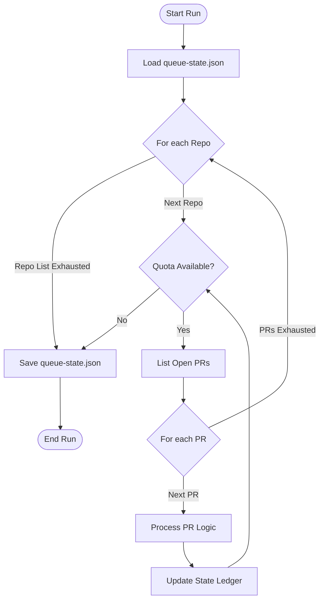
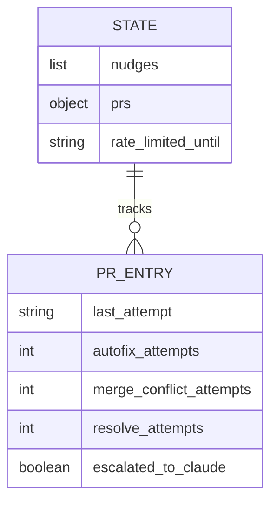

Relevant source files

The following files were used as context for generating this wiki page:

- [README.md](README.md)
- [orchestrate.py](orchestrate.py)
- [queue-state.json](queue-state.json)
- [requirements.txt](requirements.txt)
- [.github/workflows/orchestrate.yml](README.md) (Referenced via README)

# High-Level Architecture

The `coderabbit-queue` system is a central, account-wide orchestrator designed to manage AI code review interactions across multiple GitHub repositories. Its primary purpose is to circumvent account-wide API rate limits imposed by CodeRabbit (5 reviews per hour) by consolidating multiple independent repository workflows into a single, state-aware management process.

The architecture centralizes the decision-making logic for "nudging" AI bots like CodeRabbit, Cubic, and Sentry Seer. By tracking every nudge in a persistent state file, it enforces a global budget and per-Pull Request (PR) cooldowns, ensuring continuous operation without hitting gridlock caused by parallel, uncoordinated workflows.

Sources: [README.md:1-15](README.md#L1-L15), [orchestrate.py:5-15](orchestrate.py#L5-L15)

## System Components and Data Flow

The system consists of a Python-based orchestrator, a JSON state repository, and external GitHub integrations.

### Core Components

| Component | Description |
| :--- | :--- |
| **Orchestrator (`orchestrate.py`)** | The central logic engine that iterates through repos, evaluates PR states, and executes commands. |
| **State File (`queue-state.json`)** | A persistent ledger tracking nudge history, PR-specific attempt counts, and global rate limit status. |
| **GitHub CLI (`gh`)** | The primary interface for interacting with GitHub's REST and GraphQL APIs. |
| **Sentry SDK** | Used for error tracking, performance monitoring, and capturing operator feedback. |

Sources: [README.md:18-25](README.md#L18-L25), [orchestrate.py:20-50](orchestrate.py#L20-L50), [requirements.txt:1](requirements.txt#L1)

### Architectural Flow

The orchestrator follows a cyclical flow: loading current state, iterating through a hardcoded list of 16 repositories, processing open PRs, and saving the updated state.

The diagram shows the main execution loop of the orchestrator, including quota checks at both repository and PR levels.
Sources: [orchestrate.py:535-585](orchestrate.py#L535-L585), [README.md:18-25](README.md#L18-L25)

## Logic and Decision Engine

The system uses a priority-based decision tree to determine the appropriate action for any given Pull Request.

### Nudge Priority Matrix
The orchestrator evaluates PRs in a specific order to maximize efficiency and resolve blockers.

1.  **Cubic Failures**: Retries failed Cubic AI commands if under the retry limit.
2.  **Rate Limit Detection**: Skips all AI-related actions if CodeRabbit's internal rate limit is detected in comments.
3.  **Merge Conflicts**: Commands CodeRabbit to resolve conflicts.
4.  **Branch Status**: Updates branches that are behind the base branch.
5.  **Missing Reviews**: Triggers initial reviews from CodeRabbit or Sentry.
6.  **Unresolved Threads**: Triggers "autofix" for bot-originated comments.
7.  **Final Fallback**: Uses `@resolve` or escalates to human-in-the-loop via `@claude` (labeling).

Sources: [orchestrate.py:385-530](orchestrate.py#L385-L530), [README.md:20-25](README.md#L20-L25)

### State Schema (`queue-state.json`)
The state file maintains the memory of the system across separate GitHub Action runs.

The diagram represents the structure of the JSON state file used to persist orchestrator data.
Sources: [queue-state.json:1-25](queue-state.json#L1-L25), [orchestrate.py:100-115](orchestrate.py#L100-L115)

## Quota and Rate Limit Management

The orchestrator enforces a strict budget to remain under the CodeRabbit 5/hour cap.

*  **QUOTA_PER_HOUR**: Set to 4 (a safety margin).
*  **QUOTA_WINDOW_MINUTES**: 60 minutes.
*  **PER_PR_COOLDOWN_MINUTES**: 20 minutes to prevent hammering a single PR.
*  **External Rate Limit Detection**: The system uses a regex (`RATE_LIMIT_PATTERN`) to parse CodeRabbit's own comments for authoritative rate limit signals (e.g., "More reviews will be available in 21 minutes").

Sources: [orchestrate.py:65-80](orchestrate.py#L65-L80), [orchestrate.py:85-95](orchestrate.py#L85-L95), [orchestrate.py:200-220](orchestrate.py#L200-L220)

## External Integrations

The system integrates with multiple AI tools and GitHub features:

### Bot Commands
- **CodeRabbit**: `@coderabbitai review`, `@coderabbitai autofix`, `@coderabbitai resolve`.
- **Cubic**: `@cubic-dev-ai fix this issue in this branch`.
- **Sentry**: `@sentry review`.

### GitHub Operations
- **Branch Management**: Uses the `PUT /pulls/{number}/update-branch` API.
- **Auto-Merge**: Enables auto-merge (SQUASH) via GraphQL mutations if a PR is "all clear" but pending.
- **Escalation**: Applies the `ask-claude` label to trigger high-level AI analysis when automated fixes fail.

Sources: [orchestrate.py:410-530](orchestrate.py#L410-L530), [orchestrate.py:315-380](orchestrate.py#L315-L380)

## Conclusion
The `coderabbit-queue` architecture transforms a set of uncoordinated, high-frequency bot interactions into a disciplined, stateful queue. By leveraging a centralized Python orchestrator and the GitHub CLI, it ensures that AI review resources are distributed fairly across the repository fleet while respecting external service constraints.

Sources: [README.md:1-15](README.md#L1-L15), [orchestrate.py:5-15](orchestrate.py#L5-L15)
