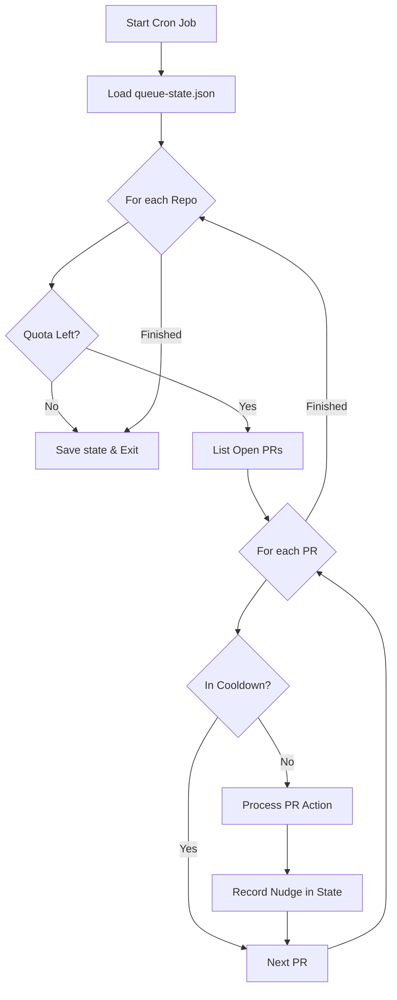
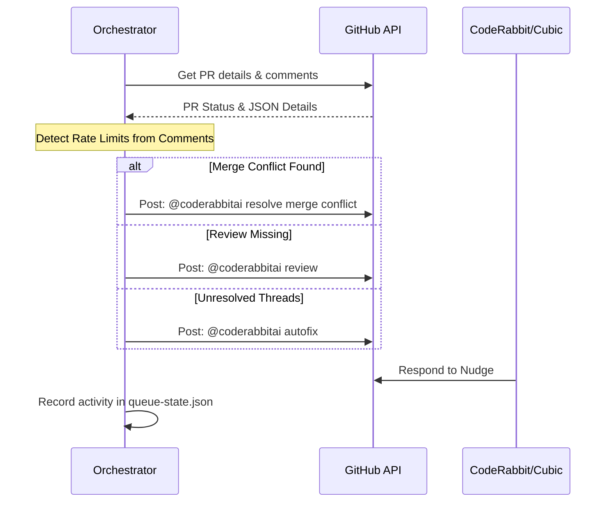

<details>
<summary>Relevant source files</summary>

The following files were used as context for generating this wiki page:

- [README.md](README.md)
- [orchestrate.py](orchestrate.py)
- [queue-state.json](queue-state.json)
- [requirements.txt](requirements.txt)
- [.github/workflows/orchestrate.yml](README.md) (Referenced via README)
</details>

# GitHub Actions Orchestration

GitHub Actions Orchestration in this project serves as a centralized, account-wide mechanism to manage and nudge the CodeRabbit AI (`@coderabbitai`) across multiple repositories. Its primary purpose is to bypass the limitations of CodeRabbit's account-wide review quota (5 reviews per hour) by replacing individual per-repo workflows with a single, state-aware orchestrator. This prevents "gridlock" where multiple independent workflows simultaneously exhaust the shared quota.

Sources: [README.md:1-15](README.md#L1-L15), [orchestrate.py:1-15](orchestrate.py#L1-L15)

## System Architecture

The orchestration system is built around a Python-based execution engine (`orchestrate.py`) triggered by a GitHub Actions cron job. It maintains a persistent state file (`queue-state.json`) to track "nudges" and rate limits across 16 hardcoded target repositories.

### Core Components

*  **Orchestrator Script:** A Python script that loops through target repositories, evaluates open Pull Requests (PRs), and executes necessary actions using the GitHub CLI (`gh`).
*  **State Ledger:** A JSON file used to track the history of nudges, per-PR cooldowns, and the global hourly budget.
*  **Action Logic:** A prioritized decision tree that handles merge conflicts, missing reviews, and unresolved threads.

Sources: [README.md:17-30](README.md#L17-L30), [orchestrate.py:43-60](orchestrate.py#L43-L60)

### Orchestration Flow

The following diagram illustrates the high-level logic used during a single orchestration run.



The orchestrator ensures that no more than the defined `QUOTA_PER_HOUR` nudges are sent globally, even across different repositories.
Sources: [orchestrate.py:460-510](orchestrate.py#L460-L510), [README.md:21-30](README.md#L21-L30)

## Action Priority and Decision Logic

The orchestrator processes each PR based on a strict hierarchy of needs. If a PR requires multiple types of attention, the highest priority action is taken, and the PR enters a cooldown period.

| Priority | Issue | Action |
| :--- | :--- | :--- |
| 1 | Merge Conflict | `@coderabbitai resolve merge conflict` |
| 2 | Outdated Branch | Update branch (merge base into PR) |
| 3 | Missing Review | `@coderabbitai review` / `@sentry review` |
| 4 | Unresolved Threads | `@coderabbitai autofix` / `@cubic-dev-ai fix` |
| 5 | Stale Threads | `@coderabbitai resolve` (Force Resolve) |
| 6 | Auto-merge | Enable GitHub Auto-merge (Squash) |

Sources: [orchestrate.py:320-450](orchestrate.py#L320-L450), [README.md:21-25](README.md#L21-L25)

### Nudge Process Sequence

The sequence below shows how the orchestrator interacts with GitHub and AI bots to resolve issues on a specific PR.



The orchestrator reads CodeRabbit's own comments to identify authoritative rate limit signals, adjusting its `rate_limited_until` timestamp accordingly.
Sources: [orchestrate.py:175-200](orchestrate.py#L175-L200), [orchestrate.py:320-450](orchestrate.py#L320-L450)

## State Management and Quota Enforcement

The system uses `queue-state.json` as a persistent database. This file is committed back to the repository after every Action run to ensure continuity.

### Configuration Constants

The system is tuned with specific thresholds to stay safely under API limits:

*  **QUOTA_PER_HOUR:** 4 (Safety margin under the real cap of 5).
*  **QUOTA_WINDOW_MINUTES:** 60.
*  **PER_PR_COOLDOWN_MINUTES:** 20.
*  **MAX_AUTOFIX_ATTEMPTS:** 2.
*  **MAX_RESOLVE_ATTEMPTS:** 1.

Sources: [orchestrate.py:77-85](orchestrate.py#L77-L85)

### State Schema

The state file tracks the following data structures:

```json
{
  "nudges": [
    { "ts": "ISO-Timestamp", "repo": "name", "pr": 123, "type": "review" }
  ],
  "prs": {
    "owner/repo#123": {
      "last_attempt": "ISO-Timestamp",
      "autofix_attempts": 2,
      "escalated_to_claude": true
    }
  },
  "rate_limited_until": "ISO-Timestamp"
}
```

Sources: [queue-state.json:1-25](queue-state.json#L1-L25), [orchestrate.py:105-120](orchestrate.py#L105-L120)

## Error Handling and Escalation

The orchestrator includes robust error handling, specifically for third-party AI failures and rate limits.

### AI Failures and Claude Escalation
If a PR remains unresolved after maximum attempts of `autofix` or `resolve`, the system escalates the issue by adding the `ask-claude` label. This triggers a separate, more capable workflow to handle complex issues that smaller AI models cannot resolve.
Sources: [orchestrate.py:300-315](orchestrate.py#L300-L315), [orchestrate.py:425-440](orchestrate.py#L425-L440)

### External Monitoring
The project integrates `sentry-sdk` for error tracking and performance profiling. Every orchestration run is wrapped in a Sentry transaction (`orchestrator-run`), and exceptions are captured with local variable context disabled for security.
Sources: [requirements.txt:1](requirements.txt#L1), [orchestrate.py:35-42](orchestrate.py#L35-L42), [orchestrate.py:460-465](orchestrate.py#L460-L465)

## Conclusion

The GitHub Actions Orchestration system provides a disciplined way to utilize AI code reviews across a large portfolio of repositories. By centralizing the logic into a single stateful runner, it ensures that account-wide quotas are respected, per-PR noise is minimized through cooldowns, and critical issues like merge conflicts are prioritized or escalated to more advanced models when automated fixes fail.
