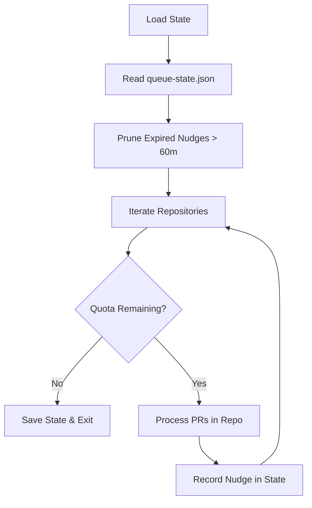
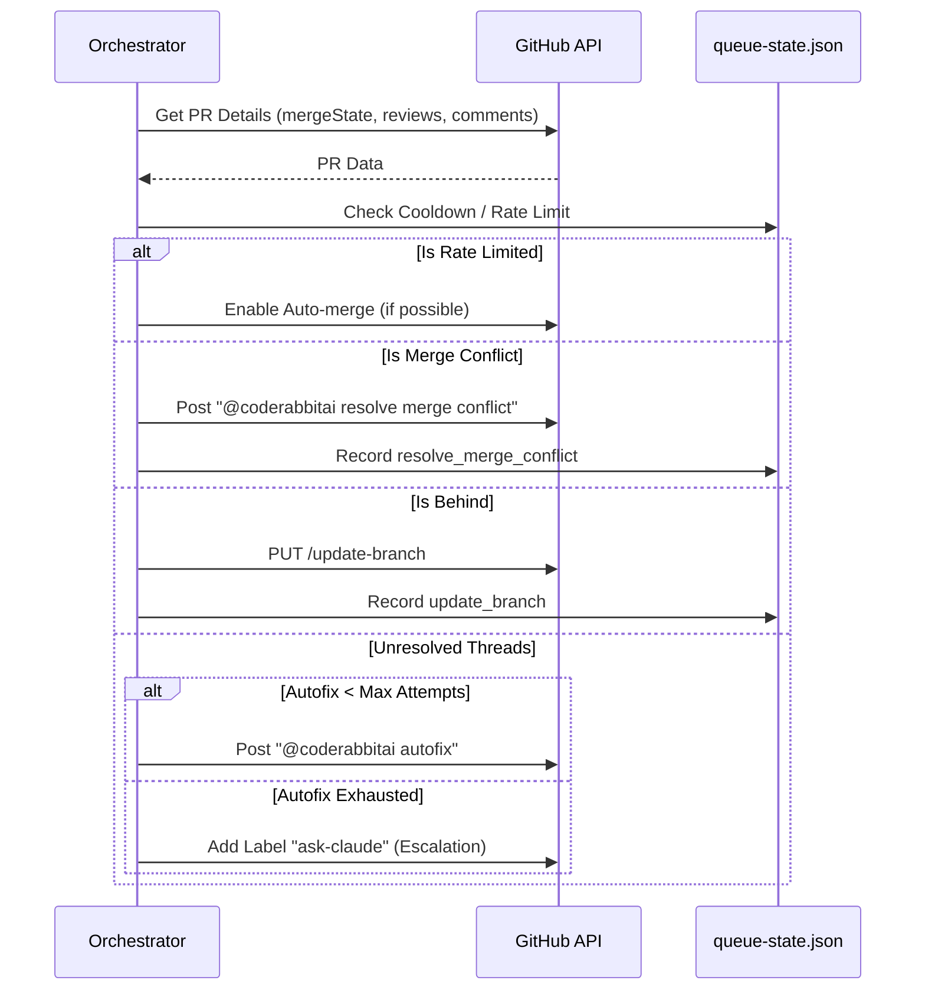

<details>
<summary>Relevant source files</summary>

The following files were used as context for generating this wiki page:

- [orchestrate.py](orchestrate.py)
- [README.md](README.md)
- [queue-state.json](queue-state.json)
- [requirements.txt](requirements.txt)
- [.github/workflows/orchestrate.yml](README.md) (Referenced in README)

</details>

# The Python Orchestrator Script

The Python Orchestrator Script is a central tool designed to manage and prioritize CodeRabbit (`@coderabbitai`) review nudges across multiple repositories. Its primary purpose is to circumvent account-wide rate limits (5 reviews per hour) that previously caused gridlock when multiple repositories independently triggered workflows. It replaces individual `coderabbit-rewake.yml` files with a single, state-aware cron job that enforces a shared budget and cooldown periods.

Sources: [README.md:6-18](README.md#L6-L18), [orchestrate.py:5-13](orchestrate.py#L5-L13)

## System Architecture

The orchestrator operates as a stateful loop that iterates through a hardcoded list of target repositories. It utilizes the GitHub CLI (`gh`) to interact with the GitHub API for fetching Pull Request (PR) details, posting comments, and updating branches. The script maintains a local `queue-state.json` file to track nudge history, PR-specific attempts, and authoritative rate limit data received from CodeRabbit comments.

### Core Components and Configuration

The script defines several constants to control the flow and volume of interactions:

| Constant | Description | Value |
| :--- | :--- | :--- |
| `QUOTA_PER_HOUR` | The maximum number of nudges allowed in a rolling 60-minute window. | 4 |
| `QUOTA_WINDOW_MINUTES` | The duration of the rolling window for quota tracking. | 60 |
| `PER_PR_COOLDOWN_MINUTES` | Minimum time to wait before nudging the same PR again. | 20 |
| `MAX_AUTOFIX_ATTEMPTS` | Max tries for `@coderabbitai autofix` before falling back to `@resolve`. | 2 |
| `MAX_MERGE_CONFLICT_ATTEMPTS` | Max tries to nudge the merge-conflict resolver. | 2 |
| `REPOS` | List of target repositories under the `blixten85` owner. | 16 repos |

Sources: [orchestrate.py:33-55](orchestrate.py#L33-L55), [orchestrate.py:58-75](orchestrate.py#L58-L75)

### Data Flow and State Management

The `queue-state.json` file serves as the persistence layer, tracking every nudge type and timestamp.



The state tracks specific counters for `autofix_attempts`, `resolve_attempts`, and `merge_conflict_attempts` to manage escalation logic. 
Sources: [orchestrate.py:110-155](orchestrate.py#L110-L155), [queue-state.json:7-40](queue-state.json#L7-L40)

## Pull Request Processing Logic

The orchestrator follows a strict hierarchy of needs for each PR. It checks for blockers like merge conflicts before attempting to trigger new reviews or autofixes.

### Priority Nudge Hierarchy
1.  **Cubic Failures**: Retries failed commands for the cubic AI tool.
2.  **Rate Limit Detection**: Backs off if CodeRabbit explicitly mentions a rate limit in a comment.
3.  **Merge Conflicts**: Sends `@coderabbitai resolve merge conflict`.
4.  **Branch Updates**: Merges the base branch into the PR if the PR is `BEHIND`.
5.  **Missing Reviews**: Triggers `@coderabbitai review` or `@sentry review` if checks are missing.
6.  **Unresolved Threads**: Triggers `@coderabbitai autofix`, `@cubic-dev-ai fix`, or `@coderabbitai resolve`.
7.  **Auto-merge**: Enables GitHub auto-merge if all other conditions are met.

Sources: [orchestrate.py:441-555](orchestrate.py#L441-L555)

### Sequence of PR Evaluation

The following sequence diagram illustrates how a single PR is evaluated against the orchestrator's rules:



Sources: [orchestrate.py:452-563](orchestrate.py#L452-L563), [orchestrate.py:566-578](orchestrate.py#L566-L578)

## Monitoring and Integration

The orchestrator integrates with **Sentry** for error tracking and performance monitoring. It captures exceptions during the main loop and tracks specific spans for GitHub CLI operations.

```python
# Sentry initialization and tracing setup
sentry_sdk.init(
    dsn=os.environ.get("SENTRY_DSN"),
    traces_sample_rate=1.0,
    enable_logs=True,
)
```

Sources: [orchestrate.py:27-40](orchestrate.py#L27-L40), [requirements.txt:1](requirements.txt#L1)

### Key Functions for External Interaction

- `run_gh(args)`: Executes GitHub CLI commands with Sentry tracing and error handling. Sources: [orchestrate.py:302-316](orchestrate.py#L302-L316)
- `get_unresolved_threads_by_author(repo, number)`: Uses a GraphQL query to group unresolved threads by the bot that created them, allowing for targeted nudges. Sources: [orchestrate.py:365-418](orchestrate.py#L365-L418)
- `detect_and_record_rate_limit(state, details)`: Scans comments for `RATE_LIMIT_PATTERN` to set an authoritative `rate_limited_until` timestamp. Sources: [orchestrate.py:252-272](orchestrate.py#L252-L272)

## Conclusion
The Python Orchestrator Script centralizes the management of AI code review bots to ensure efficient use of account-wide quotas. By implementing priority-based logic, cooldowns, and a clear escalation path (eventually leading to `ask-claude` labeling), it prevents the gridlock and high costs associated with uncoordinated per-repository workflows.

Sources: [README.md:12-25](README.md#L12-L25), [orchestrate.py:5-20](orchestrate.py#L5-L20)
