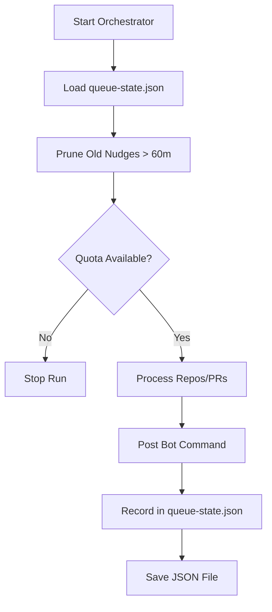
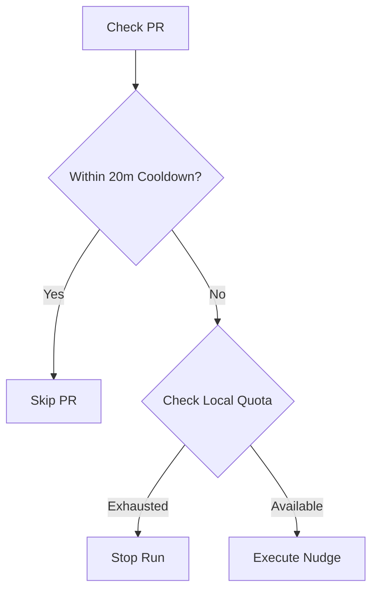

Relevant source files

The following files were used as context for generating this wiki page:

- [requirements.txt](requirements.txt)
- [orchestrate.py](orchestrate.py)
- [README.md](README.md)
- [queue-state.json](queue-state.json)
- [.github/workflows/orchestrate.yml](README.md) (Referenced in README)

# Dependency Management

Dependency management in the `coderabbit-queue` project is focused on maintaining a minimal runtime environment and orchestrating interactions between multiple external AI review services and GitHub's API. The primary objective is to manage account-wide quotas and state across 16 different repositories to prevent service gridlock caused by overlapping automated workflows.

The system relies on a combination of Python-based libraries for monitoring and standard system utilities (like the GitHub CLI) for executing pull request operations. State is persisted locally in a JSON file to track historical interactions and enforce rate limits.

## Project Dependencies

The project utilizes a small set of external libraries and tools to perform its orchestration tasks. These dependencies are categorized into runtime libraries, system tools, and environmental requirements.

### Runtime Libraries
The core logic is written in Python and uses a single primary external package for error tracking and performance monitoring.

| Package | Version Range | Purpose |
| :--- | :--- | :--- |
| `sentry-sdk` | `>=2.66.0, <3` | Error tracking, tracing, and profiling of the orchestrator runs. |

Sources: [requirements.txt:1](requirements.txt#L1)

### System Tools
The orchestrator heavily relies on the GitHub CLI (`gh`) to interact with the GitHub API. This is the primary mechanism for querying PR status and posting comments.

*  **GitHub CLI (`gh`)**: Used for `pr list`, `pr view`, `pr comment`, and `api graphql` calls.
*  **Python 3**: The execution environment for `orchestrate.py`.

Sources: [orchestrate.py:202-214](orchestrate.py#L202-L214), [README.md:46-50](README.md#L46-L50)

## Service Dependencies and Quota Orchestration

The system manages dependencies on external AI review services by strictly enforcing a shared budget. This prevents hitting the account-wide 5 reviews/hour limit imposed by CodeRabbit.

### Service Targets
The orchestrator manages interactions with the following bots/services:
*  **CodeRabbit (`@coderabbitai`)**: Primary review and fix engine.
*  **Cubic (`@cubic-dev-ai`)**: Specialized fix engine with its own command syntax.
*  **Sentry Seer (`@sentry`)**: AI review engine for identifying vulnerabilities.
*  **Claude (`ask-claude` label)**: Final fallback for complex issues.

Sources: [orchestrate.py:65-88](orchestrate.py#L65-L88), [README.md:10-15](README.md#L10-L15)

### Quota Logic Flow
The orchestrator tracks "nudges" sent to these services. A "nudge" is defined as any action that consumes the review quota, including branch updates and comment-based commands.

The flow ensures that no more than 4 nudges are sent per rolling 60-minute window, providing a safety margin under the service cap.
Sources: [orchestrate.py:53-56](orchestrate.py#L53-L56), [orchestrate.py:116-120](orchestrate.py#L116-L120), [README.md:20-25](README.md#L20-L25)

## State Management and Persistence

The project uses `queue-state.json` as a flat-file database to track the state of PRs across all managed repositories. This file acts as the "source of truth" for dependency cooldowns and attempt counters.

### State Schema
The state file tracks three primary categories of information:

| Field | Type | Description |
| :--- | :--- | :--- |
| `nudges` | `List[Object]` | History of actions within the current quota window (timestamp, repo, pr, type). |
| `prs` | `Map` | PR-specific metadata including `autofix_attempts`, `resolve_attempts`, and `last_attempt`. |
| `rate_limited_until` | `ISO8601 String` | Authoritative backoff timestamp derived directly from CodeRabbit's error responses. |

Sources: [queue-state.json:1-12](queue-state.json#L1-L12), [orchestrate.py:101-110](orchestrate.py#L101-L110)

### Cooldown and Retry Logic
To avoid "hammering" a specific dependency, the system enforces a 20-minute cooldown per PR.

Sources: [orchestrate.py:56-60](orchestrate.py#L56-L60), [orchestrate.py:195-200](orchestrate.py#L195-L200)

## Environmental Configuration

The orchestrator requires specific environmental variables to be present in the execution environment (either GitHub Actions or local dev) to interact with its dependencies.

*  **`GH_TOKEN` / `CR_QUEUE_TOKEN`**: A fine-grained Personal Access Token (PAT) with read/write permissions for pull requests across all target repositories.
*  **`SENTRY_DSN`**: (Optional) The Data Source Name for Sentry integration.

Sources: [orchestrate.py:16-18](orchestrate.py#L16-L18), [README.md:46-48](README.md#L46-L48)

## Summary

Dependency management in `coderabbit-queue` is a centralized mechanism designed to throttle and coordinate external AI review services. By abstracting the per-repo workflow into a single orchestrator, the system ensures that dependencies are utilized efficiently within their rate limits. The architecture relies on Python, the GitHub CLI, and a persistent JSON state to maintain operational continuity and prevent service gridlock.

Sources: [README.md:1-25](README.md#L1-L25), [orchestrate.py:10-25](orchestrate.py#L10-L25)
