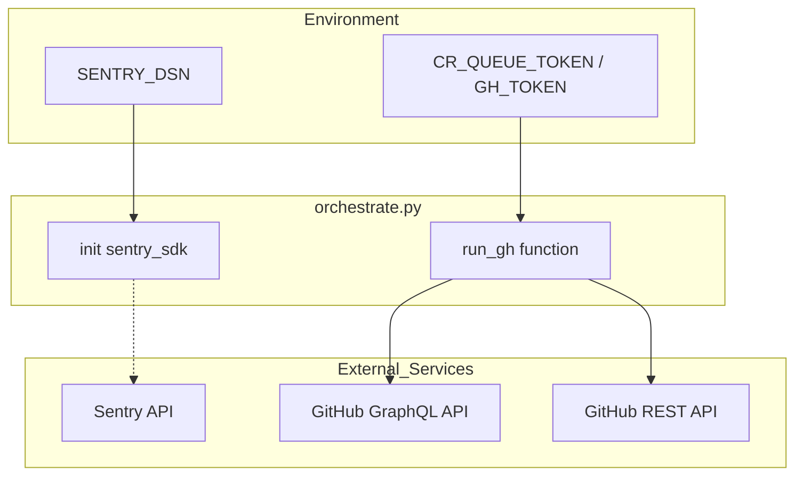
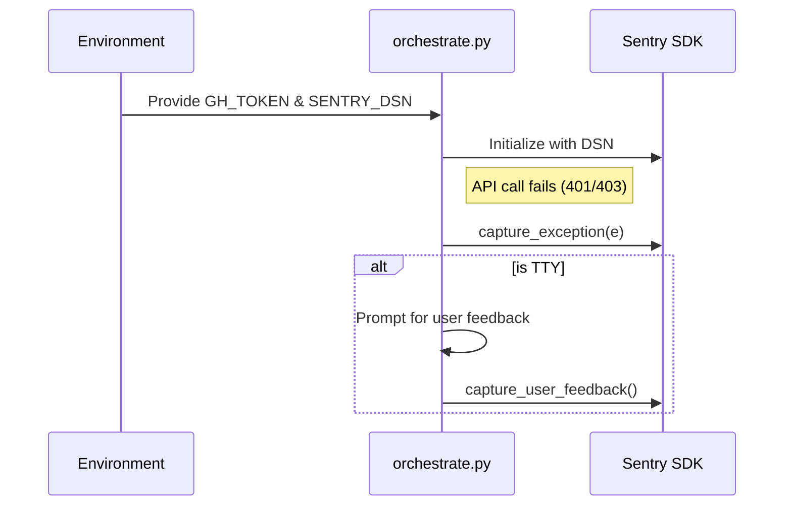

<details>
<summary>Relevant source files</summary>

The following files were used as context for generating this wiki page:

- [README.md](README.md)
- [orchestrate.py](orchestrate.py)
- [queue-state.json](queue-state.json)
- [requirements.txt](requirements.txt)
- [.github/workflows/orchestrate.yml](README.md) (Referenced in README)
</details>

# API Authentication & Tokens

## Introduction
The `coderabbit-queue` system utilizes GitHub authentication to manage and orchestrate automated code review "nudges" across multiple repositories. This is primarily handled through secure environment variables that provide the necessary permissions for the GitHub CLI (`gh`) and custom Python scripts to interact with the GitHub API.

The authentication scope covers reading pull request data, posting comments, and modifying labels or branch states across all target repositories within the `blixten85` account. This centralized approach prevents quota gridlock by using a single authenticated orchestrator instead of fragmented per-repo workflows.
Sources: [README.md:1-15](README.md#L1-L15), [orchestrate.py:12-20](orchestrate.py#L12-L20)

## Authentication Mechanisms

### GitHub Authentication
The orchestrator relies on a Personal Access Token (PAT) for authorization. This token must have read and write access to Pull Requests across the entire organization/account.

| Token Environment Variable | Description | Usage |
| :--- | :--- | :--- |
| `GH_TOKEN` | Standard GitHub token for CLI and API operations. | Used by `subprocess` calls to `gh api` and `gh pr`. |
| `CR_QUEUE_TOKEN` | Fine-grained PAT stored as a GitHub Action Secret. | Provides the underlying identity for the automated cron job. |

Sources: [README.md:44-50](README.md#L44-L50), [orchestrate.py:18-21](orchestrate.py#L18-L21)

### External Service Integration
In addition to GitHub, the system integrates with Sentry for error tracking and performance monitoring, which requires its own authentication string.

| Environment Variable | Service | Purpose |
| :--- | :--- | :--- |
| `SENTRY_DSN` | Sentry.io | Authenticates the SDK to send traces and error logs. |

Sources: [orchestrate.py:33-46](orchestrate.py#L33-L46), [requirements.txt:1](requirements.txt#L1)

## Token Data Flow

The flow of authentication starts from the environment and is passed to sub-processes that execute GitHub commands.



The diagram shows how environment tokens are ingested by the orchestrator and distributed to Sentry or the GitHub CLI for API interaction.
Sources: [orchestrate.py:33-46](orchestrate.py#L33-L46), [orchestrate.py:249-265](orchestrate.py#L249-L265)

## Security and Permission Scopes

The authentication token requires specific scopes to perform the operations hardcoded in the orchestrator:

*  **Pull Requests (Read/Write):** Required for `gh pr list`, `gh pr view`, and `gh pr comment`.
*  **Metadata (Read):** Required to fetch repository and user information.
*  **Workflow/Actions (Write):** Required for the cron job to commit state changes back to `queue-state.json`.

### CLI Invocation Pattern
Authentication is inherited by the `gh` tool when called from Python:

```python
def run_gh(args, input_text=None):
    # gh picks up GH_TOKEN from the environment automatically
    result = subprocess.run(
        ["gh"] + args,
        capture_output=True,
        text=True,
        input=input_text,
    )
```

Sources: [orchestrate.py:18-21](orchestrate.py#L18-L21), [orchestrate.py:249-265](orchestrate.py#L249-L265)

## Error Handling and Feedback
When authentication or API calls fail, the system uses Sentry to capture the failure state. If running in a TTY (local manual run), the system prompts for user feedback to accompany the error report.



The sequence illustrates the error reporting flow when an authenticated API call fails.
Sources: [orchestrate.py:641-657](orchestrate.py#L641-L657)

## Summary
Authentication in the `coderabbit-queue` project is centralized via the `GH_TOKEN` or `CR_QUEUE_TOKEN`. This token facilitates a broad set of permissions across 16 target repositories, enabling the orchestrator to act as a single point of truth. The use of a fine-grained PAT ensures that only necessary pull request and repository scopes are granted, while Sentry integration provides monitoring for the authentication and API lifecycle.
Sources: [README.md:15-30](README.md#L15-L30), [orchestrate.py:48-68](orchestrate.py#L48-L68)
