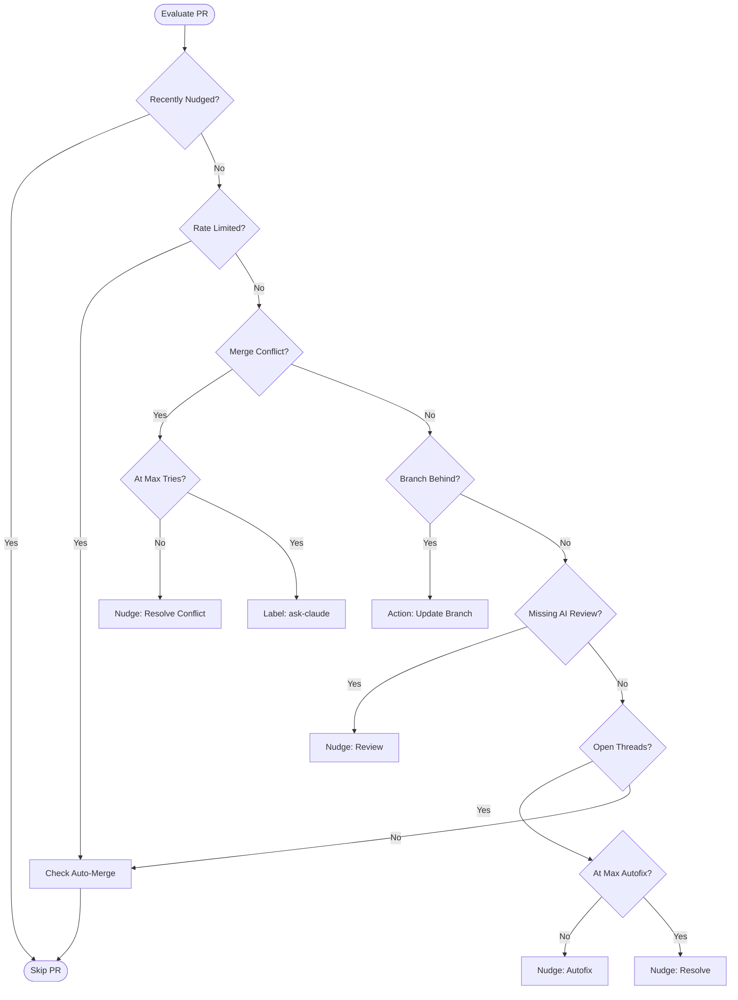
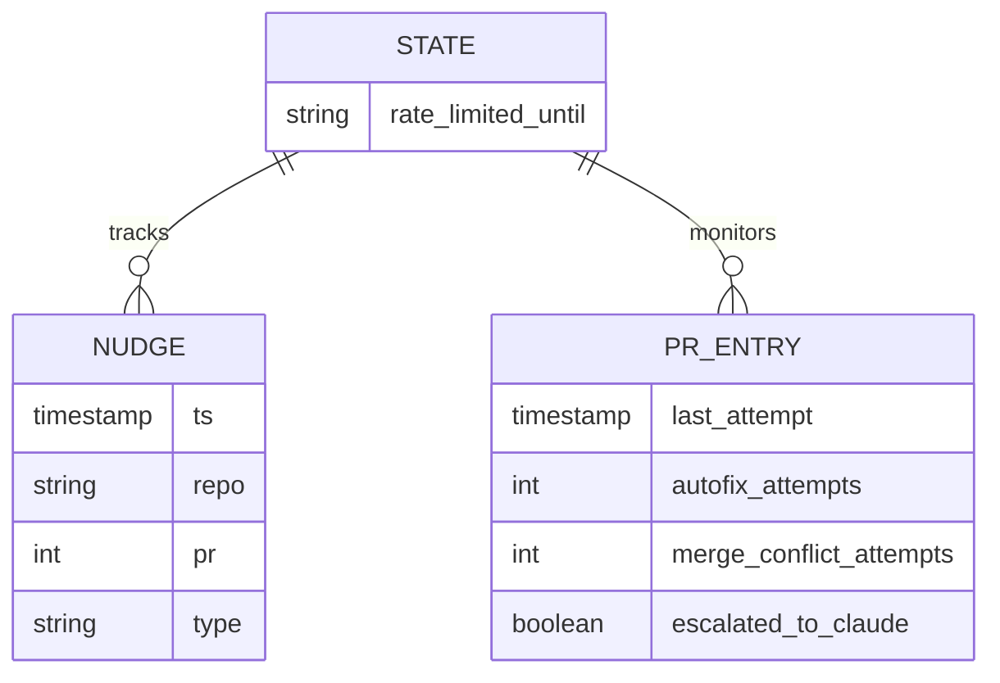

Relevant source files

The following files were used as context for generating this wiki page:

- [orchestrate.py](orchestrate.py)
- [README.md](README.md)
- [queue-state.json](queue-state.json)
- [requirements.txt](requirements.txt)
- [.github/workflows/orchestrate.yml](README.md) (Referenced via workflow documentation in README)

# PR Action Priority Logic

The **PR Action Priority Logic** is the core decision-making engine of the CodeRabbit Queue Orchestrator. Its primary purpose is to manage account-wide review quotas by intelligently selecting the most impactful action for any open pull request (PR) across multiple repositories. By centralizing this logic, the system prevents "gridlock" caused by multiple independent repositories exhausting the shared CodeRabbit 5-reviews-per-hour quota.

Sources: [README.md:1-16](README.md#L1-L16), [orchestrate.py:1-15](orchestrate.py#L1-L15)

The logic follows a strict hierarchy of needs for a PR: resolving merge conflicts takes precedence, followed by requesting missing reviews, and finally attempting automated fixes for unresolved comments. This systematic approach ensures that the most critical blockers are addressed first while staying within a safe "budget" of 4 nudges per rolling 60-minute window.

Sources: [README.md:17-25](README.md#L17-L25), [orchestrate.py:64-65](orchestrate.py#L64-L65)

## Core Priority Hierarchy

The orchestrator evaluates each PR against a set of conditions in a specific order. Once a condition is met and an action is taken, the process for that PR terminates for the current run to conserve quota.

| Priority | Condition | Action | Nudge Command |
| :--- | :--- | :--- | :--- |
| 1 | Merge Conflict | Request conflict resolution | `@coderabbitai resolve merge conflict` |
| 2 | Outdated Branch | Update branch from base | `gh api .../update-branch` |
| 3 | Missing Review | Trigger initial AI review | `@coderabbitai review` / `@sentry review` |
| 4 | Unresolved Threads | Trigger automated code fix | `@coderabbitai autofix` / `@cubic-dev-ai fix...` |
| 5 | Stuck Threads | Manual escalation | Add `ask-claude` label |
| 6 | Clear / Pending | Enable Auto-merge | `gh api .../enablePullRequestAutoMerge` |

Sources: [orchestrate.py:72-88](orchestrate.py#L72-L88), [orchestrate.py:441-554](orchestrate.py#L441-L554), [README.md:21-23](README.md#L21-L23)

### Decision Flow Diagram
The following diagram illustrates the logical path taken by `process_pr` to determine the appropriate nudge.

Sources: [orchestrate.py:441-554](orchestrate.py#L441-L554)

## Gating and Quota Enforcement

Before any priority logic is executed, the orchestrator checks global and per-PR constraints to ensure compliance with service limits.

### Global Account Quota
The system maintains a rolling window of 60 minutes. It allows a maximum of **4 nudges per hour** (defined as `QUOTA_PER_HOUR`), providing a safety margin under the actual limit of 5. If this limit is reached, the entire orchestration run stops immediately.
Sources: [orchestrate.py:64-65](orchestrate.py#L64-L65), [orchestrate.py:567-575](orchestrate.py#L567-L575)

### Per-PR Cooldown
To prevent "hammering" a single PR every time the cron job runs, a **20-minute cooldown** (`PER_PR_COOLDOWN_MINUTES`) is enforced per PR. This is tracked via the `last_attempt` timestamp in `queue-state.json`.
Sources: [orchestrate.py:66](orchestrate.py#L66), [orchestrate.py:236-242](orchestrate.py#L236-L242)

### Authority-Based Rate Limiting
Beyond internal tracking, the logic actively scans PR comments for CodeRabbit's own rate-limit notifications. If a message matching `RATE_LIMIT_PATTERN` is found, the system sets a global `rate_limited_until` timestamp and pauses all review-related nudges.
Sources: [orchestrate.py:91-94](orchestrate.py#L91-L94), [orchestrate.py:210-227](orchestrate.py#L210-L227)

## Escalation and Fallback Logic

When automated nudges fail to resolve PR issues after multiple attempts, the priority logic shifts to escalation or aggressive resolution.

### Autofix and Resolve
The orchestrator attempts a multi-stage recovery for unresolved review threads:
1.  **Autofix Phase:** Attempts up to 2 `autofix` commands.
2.  **Resolve Phase:** If autofixes fail, it sends a `@coderabbitai resolve` command to force-close threads.
3.  **Cubic Retry:** Specifically handles "Cubic command failed" errors with up to 2 retries before giving up to avoid spam.

Sources: [orchestrate.py:67-70](orchestrate.py#L67-L70), [orchestrate.py:446-462](orchestrate.py#L446-L462), [orchestrate.py:510-545](orchestrate.py#L510-L545)

### Manual Escalation (Claude)
As a final fallback for both persistent merge conflicts and unresolved threads, the orchestrator applies the `ask-claude` label. This is a one-way, one-time escalation designed to bring in human-like intervention via a separate workflow without entering a loop.
Sources: [orchestrate.py:410-423](orchestrate.py#L410-L423), [orchestrate.py:480-492](orchestrate.py#L480-L492), [queue-state.json:28-33](queue-state.json#L28-L33)

## State Management

The priority logic is stateful, relying on `queue-state.json` to persist history between GitHub Action runs.

Sources: [orchestrate.py:115-121](orchestrate.py#L115-L121), [queue-state.json:1-50](queue-state.json#L1-L50)

## Conclusion

The PR Action Priority Logic effectively transforms a set of uncoordinated repository workflows into a disciplined, account-wide queue. By prioritizing structural blockers like merge conflicts and outdated branches over iterative reviews, and by strictly enforcing self-imposed quotas, it ensures high PR throughput while remaining within AI service limits. The inclusion of multi-bot support (CodeRabbit, Cubic, Sentry) and terminal escalation paths ensures that no PR remains stuck in an automated loop indefinitely.
