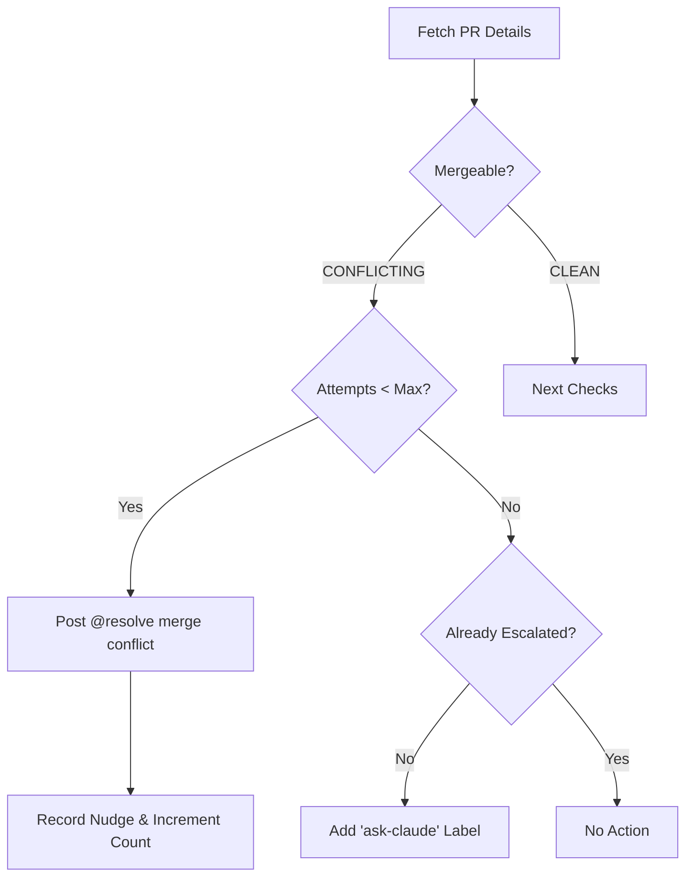
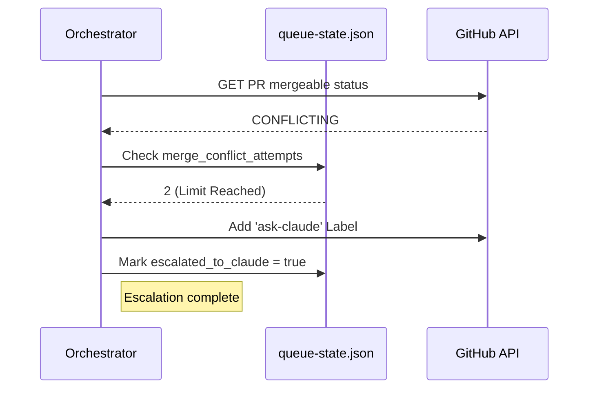

<details>
<summary>Relevant source files</summary>

The following files were used as context for generating this wiki page:

- [orchestrate.py](orchestrate.py)
- [queue-state.json](queue-state.json)
- [README.md](README.md)
- [requirements.txt](requirements.txt)
- [.github/workflows/orchestrate.yml](.github/workflows/orchestrate.yml) (referenced via [README.md](README.md))

</details>

# Merge Conflict Handling

The Merge Conflict Handling system in `coderabbit-queue` is a prioritized automation layer designed to resolve repository state issues that prevent Pull Requests (PRs) from being merged. Within the orchestration loop, merge conflicts are treated as the highest priority action, superseded only by rate-limiting checks. The system coordinates between automated AI tools (CodeRabbit) and a fallback escalation path to human-in-the-loop triggers via specialized GitHub labels.

Sources: [README.md:16-17](README.md#L16-L17), [orchestrate.py:382-386](orchestrate.py#L382-L386)

## Architecture and Logic

The system utilizes a state-machine approach to handle PRs in a `CONFLICTING` state. The logic is encapsulated within the `process_pr` function, which evaluates the `mergeable` status of a PR retrieved via the GitHub CLI (`gh`). 

### Detection and Nudging
When a PR is identified with a `mergeable` status of `CONFLICTING`, the orchestrator attempts to trigger CodeRabbit's internal conflict resolution tool using a specific comment command.



The diagram above illustrates the decision tree used to determine whether to nudge an AI bot or escalate to a higher-tier automated assistant.
Sources: [orchestrate.py:382-402](orchestrate.py#L382-L402)

### State Tracking
The system persists the number of resolution attempts in `queue-state.json`. This prevent infinite loops and allows the orchestrator to transition from automated nudges to escalation once a predefined threshold is reached.

| Configuration Constant | Value | Description |
| :--- | :--- | :--- |
| `MAX_MERGE_CONFLICT_ATTEMPTS` | 2 | Maximum number of times to nudge CodeRabbit to resolve conflicts before escalating. |
| `NUDGE_MERGE_CONFLICT` | "@coderabbitai resolve merge conflict" | The exact command string posted as a PR comment. |

Sources: [orchestrate.py:61-62](orchestrate.py#L61-L62), [orchestrate.py:68](orchestrate.py#L68)

## Escalation Path

If the automated resolution attempts (`MAX_MERGE_CONFLICT_ATTEMPTS`) are exhausted without the conflict being resolved, the system triggers an escalation path. 

### Claude Escalation
The escalation involves adding the `ask-claude` label to the PR. This is a "one-way" and "one-time" trigger designed to invoke a separate workflow (`claude-assign-trigger.yml`) without creating a loop. This mechanism was specifically implemented to prevent cost incidents and ensure that difficult conflicts receive more capable automated attention.



Sources: [orchestrate.py:317-327](orchestrate.py#L317-L327), [orchestrate.py:384-394](orchestrate.py#L384-L394)

### Data Structures
State is tracked per PR using a unique key derived from the owner, repository name, and PR number.

```json
"prs": {
    "blixten85/bastion#168": {
      "merge_conflict_attempts": 2,
      "escalated_to_claude": true,
      "last_attempt": "2026-07-17T06:05:53.019065+00:00"
    }
}
```

Sources: [queue-state.json:23-28](queue-state.json#L23-L28), [orchestrate.py:126-136](orchestrate.py#L126-L136)

## Summary of Components

The merge conflict handling logic relies on several key functions:

*  **`merge_conflict_attempts(state, repo, pr_number)`**: Retrieves the current count of attempts from the state object. (Sources: [orchestrate.py:161-163](orchestrate.py#L161-L163))
*  **`post_comment(repo, number, body)`**: Executes the GitHub CLI command to post the nudge string. (Sources: [orchestrate.py:307-314](orchestrate.py#L307-L314))
*  **`escalate_to_claude(repo, number)`**: Adds the `ask-claude` label via `gh pr edit`. (Sources: [orchestrate.py:317-332](orchestrate.py#L317-L332))
*  **`migrate_merge_conflict_attempts(data)`**: A migration utility that seeds the conflict counter from historical nudge logs to ensure continuity of state. (Sources: [orchestrate.py:100-112](orchestrate.py#L100-L112))

The system ensures that merge conflicts, which represent a total "gridlock" for PR progress, are addressed before other review-related nudges, while maintaining a strict safety margin against automated tool quotas.

Sources: [README.md:12-18](README.md#L12-L18), [orchestrate.py:382-402](orchestrate.py#L382-L402)
