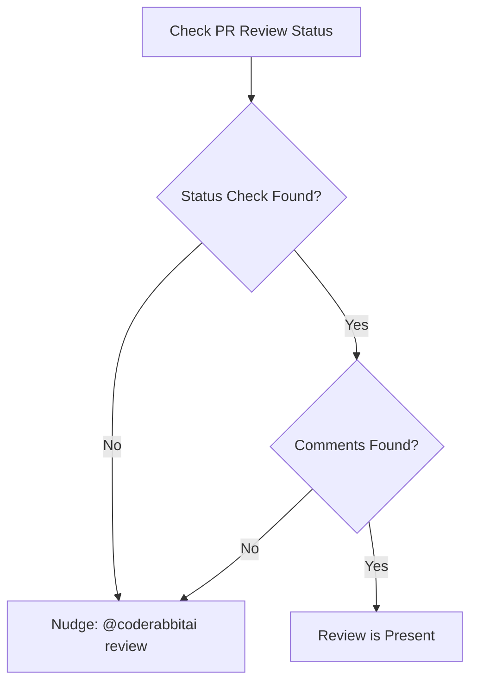
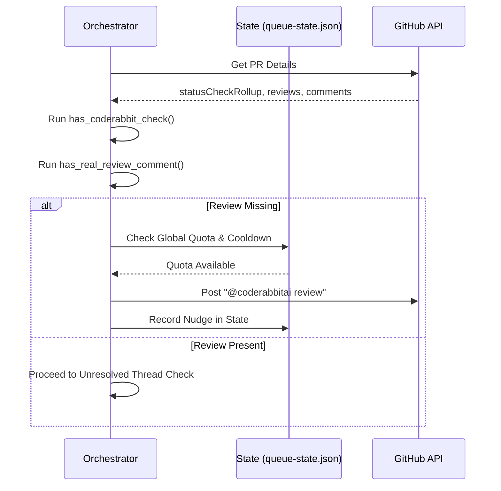

Relevant source files

The following files were used as context for generating this wiki page:

- [orchestrate.py](orchestrate.py)
- [README.md](README.md)
- [queue-state.json](queue-state.json)
- [requirements.txt](requirements.txt)
- [.github/workflows/orchestrate.yml](.github/workflows/orchestrate.yml) (referenced via README.md)

# Missing CodeRabbit Review Detection

Missing CodeRabbit Review Detection is a core logic component of the `coderabbit-queue` orchestrator. Its primary purpose is to identify open pull requests across multiple repositories that have not yet been reviewed by the `@coderabbitai` bot or are missing the necessary status checks. By detecting these gaps, the system can issue a targeted "nudge" (a GitHub comment) to trigger a review while staying within account-wide API quotas.

The detection mechanism serves as a high-priority step in the PR processing pipeline. It ensures that new or updated code receives automated scrutiny early in the lifecycle, preventing pull requests from idling without feedback. This centralized detection replaces fragmented, per-repo workflows that previously led to quota gridlock.
Sources: [README.md:1-15](README.md#L1-L15), [orchestrate.py:10-25](orchestrate.py#L10-L25)

## Detection Logic and Criteria

The system determines if a review is "missing" by evaluating two specific indicators on a pull request: the presence of a CodeRabbit status check and the existence of actual review comments from the bot.

### Review Validation Requirements
A PR is flagged as needing a review if **either** of the following conditions are met:
1.  **Missing Status Check:** The GitHub `statusCheckRollup` does not contain any check or context name including the string "coderabbit".
2.  **No Substantive Comments:** No review or comment exists that was authored by a "coderabbit" user and contains a non-empty body.

This dual-validation ensures that even if a check is pending or failed, the system recognizes when human-readable feedback is still absent.

The diagram above illustrates the decision tree used to identify missing reviews before deciding to post a nudge.
Sources: [orchestrate.py:339-366](orchestrate.py#L339-L366), [orchestrate.py:463-466](orchestrate.py#L463-L466)

## Implementation Details

The detection is implemented within `orchestrate.py` using a series of helper functions that parse JSON data returned from the GitHub CLI (`gh`).

### Key Functions
| Function | Purpose |
| :--- | :--- |
| `has_coderabbit_check(details)` | Iterates through `statusCheckRollup` to find names or contexts matching "coderabbit". |
| `has_real_review_comment(details)` | Scans `reviews` and `comments` for entries authored by CodeRabbit with valid text. |
| `process_pr(repo, number, state)` | The main coordinator that invokes detection and executes the `@coderabbitai review` nudge if criteria are met. |

Sources: [orchestrate.py:339-361](orchestrate.py#L339-L361), [orchestrate.py:442-475](orchestrate.py#L442-L475)

### Data Structures
The detection relies on the `details` object fetched via the GitHub API, specifically the following fields:
*  `statusCheckRollup`: A list of CI/CD and bot status check results.
*  `reviews`: Official GitHub Review objects.
*  `comments`: Standard PR issue comments.

Sources: [orchestrate.py:317-325](orchestrate.py#L317-L325)

## Multi-Bot Support (Seer/Sentry)
In addition to CodeRabbit, the system detects missing reviews from Sentry's AI ("Seer"). The detection follows a similar pattern but looks for check names containing "seer" or "sentry". If missing, it issues the `@sentry review` command.
Sources: [orchestrate.py:90-100](orchestrate.py#L90-L100), [orchestrate.py:349-358](orchestrate.py#L349-L358), [orchestrate.py:464-471](orchestrate.py#L464-L471)

## Constraints and Safety Gates
Detection of a missing review does not automatically result in a nudge. Several safety gates must be passed to protect the account-wide quota.

*  **Global Quota:** The system checks `QUOTA_PER_HOUR` (default: 4) before acting.
*  **Per-PR Cooldown:** A PR will not be nudged if it was already processed within the last `PER_PR_COOLDOWN_MINUTES` (default: 20).
*  **Rate Limit Detection:** The script scans comments for CodeRabbit's specific rate limit messaging (e.g., "...reviews will be available in X minutes") and pauses detection-driven nudges if a limit is active.

The sequence diagram shows how the detection logic interacts with the state management and external APIs.
Sources: [orchestrate.py:55-65](orchestrate.py#L55-L65), [orchestrate.py:155-180](orchestrate.py#L155-L180), [orchestrate.py:442-475](orchestrate.py#L442-L475)

## Conclusion
Missing CodeRabbit Review Detection is the primary mechanism for ensuring code quality coverage across the `blixten85` organization. By combining status check validation with comment analysis, it provides a reliable trigger for automated reviews while the centralized orchestration prevents API exhaustion.
Sources: [README.md:10-20](README.md#L10-L20), [orchestrate.py:1-15](orchestrate.py#L1-L15)
