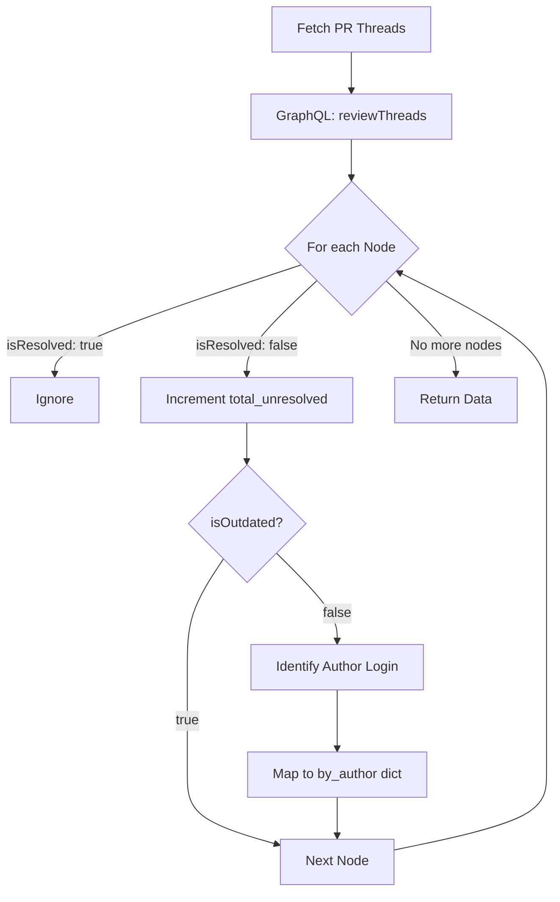
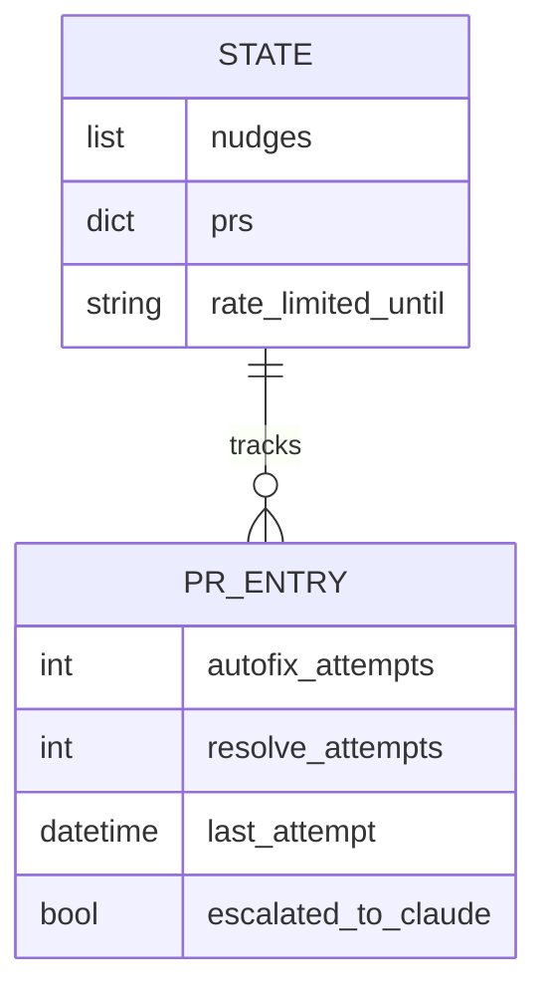

Relevant source files

The following files were used as context for generating this wiki page:

- [orchestrate.py](orchestrate.py)
- [queue-state.json](queue-state.json)
- [README.md](README.md)
- [requirements.txt](requirements.txt)
- [.github/workflows/orchestrate.yml](README.md) (Referenced via README and logic flow)

# Tracking Unresolved Threads

Tracking unresolved threads is a core mechanism within the `coderabbit-queue` orchestrator designed to resolve blockages in Pull Requests (PRs) caused by AI review comments. The system identifies which bot—specifically CodeRabbit, Cubic, or Sentry—authored an unresolved comment and triggers targeted commands to attempt automated fixes or resolutions. This ensures that PRs do not remain in a gridlocked state due to GitHub's requirement for thread resolution before merging.

The tracking logic distinguishes between "actionable" threads (new comments on current code) and "outdated" threads (comments on code that has since changed). While outdated threads still block merging, they require different handling than fresh comments to avoid incorrect context during automated fixing.

Sources: [orchestrate.py:348-369](orchestrate.py#L348-L369), [README.md:16-24](README.md#L16-L24)

## Thread Identification and Attribution

The orchestrator utilizes a GraphQL query to fetch detailed information about review threads for each PR. This allows the system to filter threads based on their resolution status and the identity of the authoring bot.

### Data Collection Logic
The function `get_unresolved_threads_by_author` categorizes threads into two primary groups:
1.  **By Author**: A mapping of bot logins (e.g., `coderabbitai`, `cubic-dev-ai`) to the count of their unresolved, non-outdated threads.
2.  **Total Unresolved**: A count of all unresolved threads, including those that are outdated.

Sources: [orchestrate.py:348-372](orchestrate.py#L348-L372)

This diagram illustrates the filtering process used to separate threads that can be automatically fixed from those that merely block the PR.
Sources: [orchestrate.py:382-419](orchestrate.py#L382-L419)

## Automated Resolution Strategies

Once threads are identified, the orchestrator follows a prioritized escalation path. It attempts specific "nudge" commands based on the bot that owns the thread.

### Targeted Nudge Commands
The system defines specific command strings used to trigger bot actions:
*  **CodeRabbit**: Uses `@coderabbitai autofix` for active threads and `@coderabbitai resolve` as a final fallback.
*  **Cubic**: Uses `@cubic-dev-ai fix this issue in this branch`.
*  **Sentry (Seer)**: No direct autofix command; triggers `@sentry review` to refresh the state.

Sources: [orchestrate.py:88-111](orchestrate.py#L88-L111), [orchestrate.py:539-551](orchestrate.py#L539-L551)

### Escalation Hierarchy
If automated attempts fail, the system transitions through these states:

| Step | Action | Condition |
| :--- | :--- | :--- |
| 1 | **Autofix** | `unresolved > 0` and `autofix_attempts < 2` |
| 2 | **Resolve** | `autofix` exhausted and `resolve_attempts < 1` |
| 3 | **Escalate** | All bot nudges failed; add `ask-claude` label |

Sources: [orchestrate.py:65-71](orchestrate.py#L65-L71), [orchestrate.py:535-573](orchestrate.py#L535-L573)

## State Persistence and Retries

Thread tracking is supported by a persistent state stored in `queue-state.json`. This file tracks the number of attempts made for each PR to prevent infinite loops and quota exhaustion.

The state object ensures that the orchestrator remembers previous interactions across different cron job runs.
Sources: [queue-state.json:1-20](queue-state.json#L1-L20), [orchestrate.py:126-140](orchestrate.py#L126-L140)

### Configuration Parameters
The following constants in `orchestrate.py` govern thread tracking behavior:

| Constant | Value | Description |
| :--- | :--- | :--- |
| `MAX_AUTOFIX_ATTEMPTS` | 2 | Max times to try `@autofix` before falling back. |
| `MAX_RESOLVE_ATTEMPTS` | 1 | Final attempt to force-resolve remaining threads. |
| `PER_PR_COOLDOWN_MINUTES` | 20 | Wait time between nudges for the same PR. |

Sources: [orchestrate.py:68-70](orchestrate.py#L68-L70), [orchestrate.py:67](orchestrate.py#L67)

## Handling Outdated Threads

A critical aspect of tracking is the handling of `isOutdated` threads. These occur when code is pushed to a PR after an AI bot has commented, but the comment was not marked as resolved.

Because the system cannot reliably "autofix" a comment that refers to a diff that no longer exists, it ignores outdated threads during the targeted bot nudge phase. However, because these threads still block the GitHub merge button, they are eventually cleared by the bot-agnostic `@coderabbitai resolve` command once all autofix attempts for current threads are exhausted.

Sources: [orchestrate.py:360-368](orchestrate.py#L360-L368), [orchestrate.py:562-573](orchestrate.py#L562-L573)

## Summary

Tracking unresolved threads allows the orchestrator to act as a precision tool, only sending nudges when necessary and targeting the specific bot responsible for the blockage. By maintaining a state-aware ledger of attempts and distinguishing between actionable and outdated threads, the system avoids redundant API calls and ensures that PRs eventually reach a mergeable state through automated resolution or human escalation.

Sources: [orchestrate.py:598-620](orchestrate.py#L598-L620), [README.md:15-24](README.md#L15-L24)
