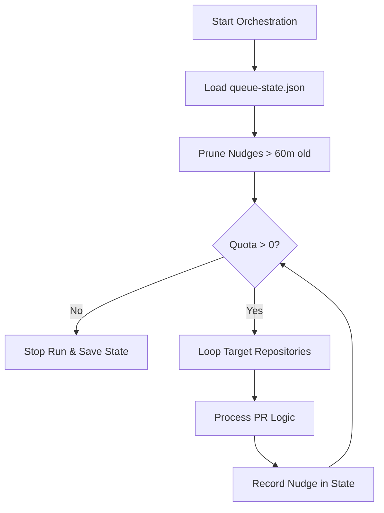
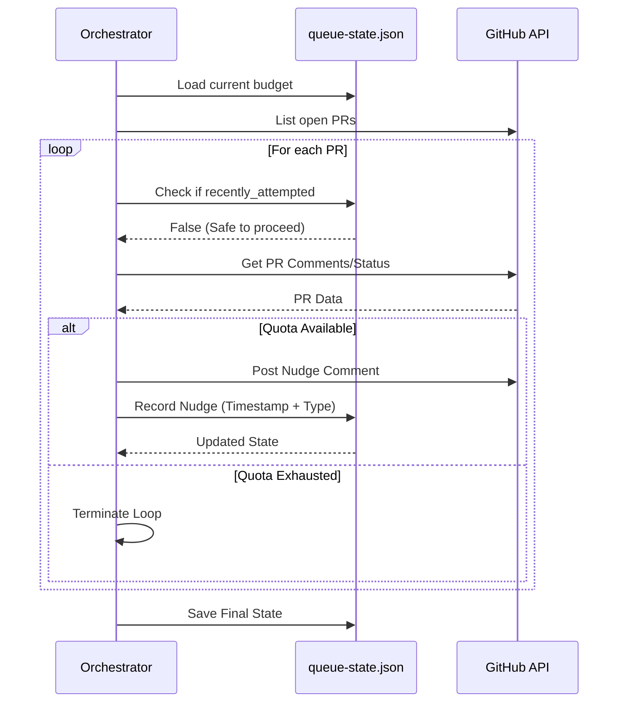

Relevant source files

The following files were used as context for generating this wiki page:

- [orchestrate.py](orchestrate.py)
- [README.md](README.md)
- [queue-state.json](queue-state.json)
- [requirements.txt](requirements.txt)
- [.github/workflows/orchestrate.yml](README.md) (Referenced via README)

# Shared Budget Enforcement

The Shared Budget Enforcement system is a central orchestration logic designed to manage CodeRabbit AI review quotas across multiple repositories. Because CodeRabbit enforces an account-wide limit (5 reviews per hour), decentralized workflows in individual repositories often clash, leading to gridlock and exhausted quotas. This system consolidates all review triggers into a single cron-based job that tracks usage in a persistent state file to ensure collective activity remains under the account-wide cap.

The primary goal of this module is to prioritize Pull Request (PR) actions—such as resolving merge conflicts, requesting new reviews, or applying autofixes—while strictly enforcing a safety margin (4 nudges per hour) to prevent account-wide rate limiting.

Sources: [README.md:5-18](README.md#L5-L18), [orchestrate.py:1-15](orchestrate.py#L1-L15)

## Quota Logic and Persistence

The system relies on a "ledger" approach where every action that consumes AI review capacity is recorded. The state is persisted in `queue-state.json`, which allows the orchestrator to track the number of nudges sent within a rolling 60-minute window across different execution runs of the GitHub Action.

### Budget Configuration
The following parameters define the enforcement boundaries:

| Parameter | Value | Description |
| :--- | :--- | :--- |
| `QUOTA_PER_HOUR` | 4 | Number of nudges allowed per rolling hour (safety margin under the 5/hour cap). |
| `QUOTA_WINDOW_MINUTES` | 60 | The timeframe used to calculate the rolling budget. |
| `PER_PR_COOLDOWN_MINUTES` | 20 | Minimum time between consecutive nudges on the same PR to prevent spam. |

Sources: [orchestrate.py:59-62](orchestrate.py#L59-L62), [README.md:16-17](README.md#L16-L17)

### State Tracking
The `queue-state.json` file serves as the database for this system. It contains:
*  **`nudges`**: A list of historical actions including timestamps, repo names, and PR numbers.
*  **`prs`**: Specific tracking for individual PRs, including attempt counters for autofixes, resolves, and merge conflicts.
*  **`rate_limited_until`**: An authoritative backoff timestamp derived directly from CodeRabbit's feedback.

Sources: [queue-state.json:1-180](queue-state.json#L1-L180), [orchestrate.py:101-115](orchestrate.py#L101-L115)

## Enforcement Workflow

The orchestrator follows a strict check-then-act flow. Before any repository or PR is processed, the system calculates the remaining quota. If the quota is exhausted, the process terminates immediately to save the remaining state for the next run.

### Rolling Window Validation
The function `quota_remaining` calculates available capacity by pruning expired nudges (older than 60 minutes) and subtracting the count of recent nudges from the `QUOTA_PER_HOUR` limit.

The diagram above shows the high-level loop where quota is checked at both the repository and individual PR level to ensure strict compliance.

Sources: [orchestrate.py:126-134](orchestrate.py#L126-L134), [orchestrate.py:488-518](orchestrate.py#L488-L518)

## Rate Limit Detection

Beyond its own internal ledger, the system performs "authoritative detection." It scans PR comments for specific patterns matching CodeRabbit's own rate-limit notifications. If CodeRabbit responds with a message indicating reviews will be available in "X minutes," the orchestrator updates the `rate_limited_until` field in the global state.

This prevents the system from "guessing" and wasting nudges on an account that is already being throttled by the provider.

Sources: [orchestrate.py:176-194](orchestrate.py#L176-L194), [orchestrate.py:90-93](orchestrate.py#L90-L93)

## Multi-Bot Priority and Scaling

When a PR requires attention, the budget enforcement logic interacts with multiple AI entities (CodeRabbit, Cubic, and Sentry Seer). Because each has different capabilities, the system prioritizes actions to maximize the value of each budget "token."

### Action Priority
1.  **Merge Conflicts**: High priority; nudged using `@coderabbitai resolve merge conflict`.
2.  **Missing Reviews**: Triggers `@coderabbitai review` or `@sentry review` if checks are missing.
3.  **Unresolved Threads**: Triggers `@coderabbitai autofix` or `@cubic-dev-ai fix`.
4.  **Resolve Fallback**: Final automated attempt to close threads via `@coderabbitai resolve`.
5.  **Escalation**: If automated attempts fail repeatedly, the PR is labeled `ask-claude` for human/advanced intervention.

This sequence demonstrates how the budget is consulted before every external API call that would trigger an AI review.

Sources: [orchestrate.py:400-478](orchestrate.py#L400-L478), [README.md:14-18](README.md#L14-L18)

## Summary of Shared Enforcement
The Shared Budget Enforcement system transforms a chaotic, multi-repo environment into a managed queue. By centralizing decision-making in `orchestrate.py` and maintaining a persistent history in `queue-state.json`, it ensures that high-priority PRs across all 16 target repositories receive reviews without exceeding the 5-per-hour account limit. It utilizes a safety buffer, authoritative rate-limit detection, and a tiered escalation strategy to maintain a continuous, automated development workflow.

Sources: [README.md:1-25](README.md#L1-L25), [orchestrate.py:1-20](orchestrate.py#L1-L20)
