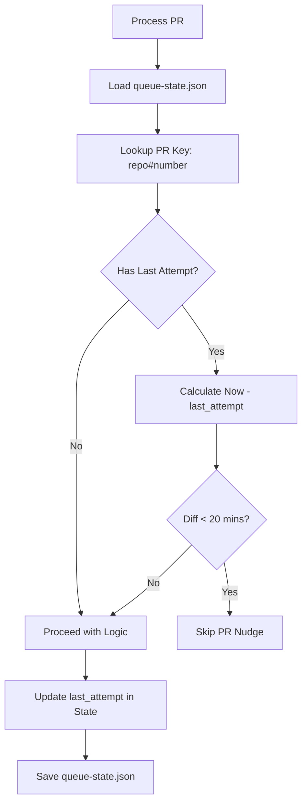
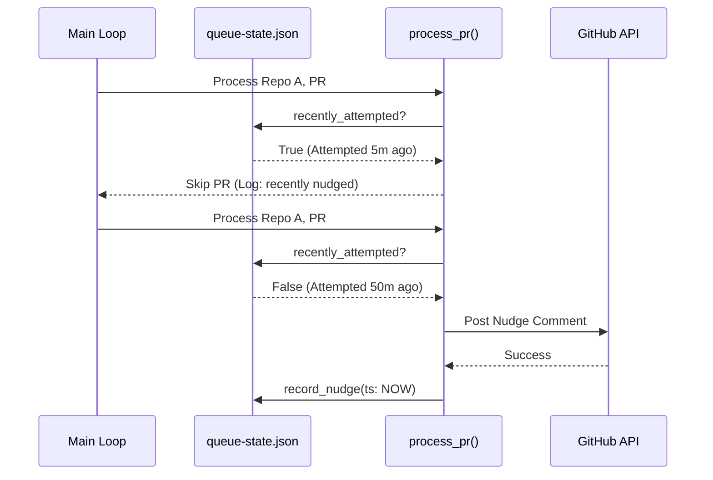

<details>
<summary>Relevant source files</summary>

The following files were used as context for generating this wiki page:

- [orchestrate.py](orchestrate.py)
- [README.md](README.md)
- [queue-state.json](queue-state.json)
- [requirements.txt](requirements.txt)
- [.github/workflows/orchestrate.yml](.github/workflows/orchestrate.yml) (referenced in README.md)

</details>

# Per-PR Cooldown Enforcement

Per-PR Cooldown Enforcement is a synchronization mechanism designed to prevent excessive automated interactions (nudges) with the same Pull Request (PR) during a single execution cycle or across frequent cron jobs. This feature ensures that individual PRs are not "hammered" every time the orchestrator runs, preserving bot resources and maintaining a clean PR history.

The enforcement logic relies on a persistent state tracking system that records the exact timestamp of the last action taken on a specific PR across any repository in the account. This local tracking complements the global account-wide quota, providing a granular layer of safety specifically for individual development workflows.
Sources: [README.md:20-22](README.md#L20-L22), [orchestrate.py:10-18](orchestrate.py#L10-L18)

## Architecture and Logic

The cooldown system is integrated directly into the `process_pr` workflow. Before any action—such as requesting a review or triggering an autofix—is taken, the orchestrator checks the persistent state to determine if the PR has been acted upon within a defined time window.

### Configuration Constants
The behavior of the cooldown is governed by specific technical constants defined in the orchestrator:

| Constant | Value | Description |
| :--- | :--- | :--- |
| `PER_PR_COOLDOWN_MINUTES` | 20 | The minimum time required between nudges for a single PR. |
| `QUOTA_WINDOW_MINUTES` | 60 | The rolling window used for global quota calculations. |
| `STATE_FILE` | `queue-state.json` | The file used to persist nudge history and timestamps. |

Sources: [orchestrate.py:64-66](orchestrate.py#L64-L66)

### Data Flow for Cooldown Checks
The logic flows from loading the current state to comparing timestamps against the current UTC time.



The system uses the `recently_attempted` function to perform this check. If the difference between `now_utc()` and the `last_attempt` timestamp stored in the state is less than 20 minutes, the PR is skipped for the current run.
Sources: [orchestrate.py:214-221](orchestrate.py#L214-L221), [orchestrate.py:417-420](orchestrate.py#L417-L420)

## Implementation Details

### State Tracking Structure
The system identifies PRs using a unique key format: `{OWNER}/{repo}#{pr_number}`. This allows the orchestrator to track state across multiple distinct repositories listed in the `REPOS` array.
Sources: [orchestrate.py:44-61](orchestrate.py#L44-L61), [orchestrate.py:126-127](orchestrate.py#L126-L127)

```json
{
  "prs": {
    "blixten85/bastion#183": {
      "autofix_attempts": 2,
      "last_attempt": "2026-07-20T05:50:54.051301+00:00",
      "resolve_attempts": 1
    }
  }
}
```

Sources: [queue-state.json:34-38](queue-state.json#L34-L38)

### Key Functions
The following functions in `orchestrate.py` manage the cooldown lifecycle:

*  **`recently_attempted(state, repo, pr_number)`**: Retrieves the `last_attempt` ISO timestamp from the state for the given PR and compares it to the current time.
*  **`record_nudge(state, repo, pr_number, nudge_type)`**: Updates the `last_attempt` field with the current UTC ISO timestamp whenever a successful nudge (via GitHub API) is performed.
*  **`now_utc()`**: Provides a standardized UTC timezone-aware datetime object for consistent comparison.

Sources: [orchestrate.py:84-86](orchestrate.py#L84-L86), [orchestrate.py:125-139](orchestrate.py#L125-L139), [orchestrate.py:214-221](orchestrate.py#L214-L221)

### Exception to Cooldown: Cubic Retries
A specific exception exists for the `cubic-dev-ai` bot. If the orchestrator detects a "command failed" message from Cubic, it may bypass the standard 20-minute cooldown to perform an immediate retry, provided the `MAX_CUBIC_RETRY_ATTEMPTS` (2) has not been reached. This ensures transient bot failures are addressed without waiting for a full cycle.
Sources: [orchestrate.py:69](orchestrate.py#L69), [orchestrate.py:404-415](orchestrate.py#L404-L415)

## Sequence of Enforcement
The following sequence diagram illustrates how the per-PR cooldown is applied within the context of a global run.



Sources: [orchestrate.py:214-221](orchestrate.py#L214-L221), [orchestrate.py:417-420](orchestrate.py#L417-L420), [orchestrate.py:535-565](orchestrate.py#L535-L565)

## Summary
Per-PR Cooldown Enforcement acts as a critical stability layer in the `coderabbit-queue` system. By mandating a 20-minute interval between actions on any single PR, it prevents redundant API calls and ensures that bot-generated fixes and reviews have sufficient time to process before the orchestrator attempts subsequent escalations or resolutions.
Sources: [README.md:20-22](README.md#L20-L22), [orchestrate.py:66](orchestrate.py#L66)
