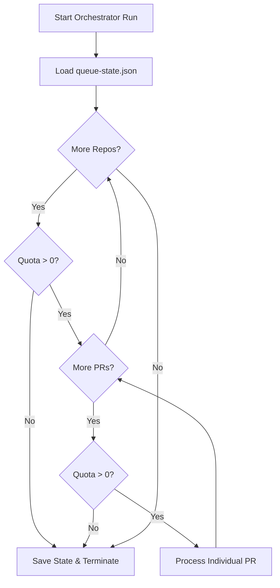

<details>
<summary>Relevant source files</summary>

The following files were used as context for generating this wiki page:

- [orchestrate.py](orchestrate.py)
- [queue-state.json](queue-state.json)
- [README.md](README.md)
- [requirements.txt](requirements.txt)
- [.github/workflows/orchestrate.yml](.github/workflows/orchestrate.yml) (Inferred from project structure and README references)
</details>

# Graceful Run Termination

The "Graceful Run Termination" feature in the `coderabbit-queue` orchestrator ensures that the system stays within account-wide API quotas by monitoring usage in real-time and halting execution immediately when limits are reached. This mechanism prevents "gridlock" caused by multiple repositories independently exhausting a shared review quota.

By tracking every "nudge" (action) sent to CodeRabbit and other bots, the orchestrator maintains a persistent state that allows it to stop a run, save progress, and resume processing remaining Pull Requests (PRs) in subsequent scheduled runs.

Sources: [README.md:9-25](README.md#L9-L25), [orchestrate.py:10-20](orchestrate.py#L10-L20)

## Quota Monitoring and Early Exit

The orchestrator utilizes a "Global Quota" system to regulate the number of actions performed within a rolling 60-minute window. Before processing each repository and each individual PR, the system checks the `quota_remaining` against a predefined limit.

If the quota is exhausted, the orchestrator:
1.  Logs a warning to Sentry.
2.  Stops the iteration over repositories and PRs.
3.  Saves the current state to `queue-state.json`.
4.  Terminates the process cleanly.

Sources: [orchestrate.py:587-601](orchestrate.py#L587-L601), [orchestrate.py:612-622](orchestrate.py#L612-L622)

### Termination Logic Flow

The following diagram illustrates how the orchestrator evaluates quota levels at multiple stages of the execution loop.



The logic ensures that no new network requests or bot nudges are initiated once the ledger indicates the limit has been reached. 
Sources: [orchestrate.py:590-630](orchestrate.py#L590-L630)

## State Persistence

Graceful termination relies on the ability to save the current ledger of nudges so that the next run (typically triggered by a cron job) has an accurate history of recent activity.

### The State Schema
The state is stored in `queue-state.json` and includes three primary components relevant to termination:
*  **nudges**: A list of recent actions with timestamps, used to calculate the rolling window usage.
*  **prs**: Detailed attempt counters per PR to prevent infinite retry loops.
*  **rate_limited_until**: An authoritative backoff timestamp if a bot explicitly signals a rate limit.

| Field | Type | Description |
| :--- | :--- | :--- |
| `nudges` | `list` | Contains `{"ts": iso, "repo": str, "pr": int, "type": str}`. |
| `rate_limited_until` | `string (ISO)` | Global backoff timestamp derived from bot comments. |
| `last_attempt` | `string (ISO)` | Per-PR timestamp to enforce a 20-minute cooldown. |

Sources: [orchestrate.py:112-118](orchestrate.py#L112-L118), [queue-state.json:2-10](queue-state.json#L2-L10)

## External Rate Limit Detection

Beyond the internal ledger, the system performs "Graceful Termination" of specific nudge types by scanning PR comments for authoritative rate limit messages from CodeRabbit. If a message matching `RATE_LIMIT_PATTERN` is found, the system updates the global `rate_limited_until` field and skips all further review-related nudges for the remainder of the run.

```python
# orchestrate.py:91-93
RATE_LIMIT_PATTERN = re.compile(
    r"more reviews will be available in (\d+)\s*(minute|hour)s?", re.IGNORECASE
)
```

Sources: [orchestrate.py:91-93](orchestrate.py#L91-L93), [orchestrate.py:182-201](orchestrate.py#L182-L201)

## Error Handling and Sentry Integration

To ensure termination is graceful even during unexpected failures, the orchestrator is wrapped in a Sentry transaction. If an unhandled exception occurs:
1.  The exception is captured and sent to Sentry.
2.  The current state is flushed.
3.  If running interactively, the operator is prompted for feedback before the process exits.

Sources: [orchestrate.py:40-52](orchestrate.py#L40-L52), [orchestrate.py:641-655](orchestrate.py#L641-L655), [requirements.txt:1](requirements.txt#L1)

## Summary of Termination Constants

| Constant | Value | Description |
| :--- | :--- | :--- |
| `QUOTA_PER_HOUR` | 4 | Max nudges per 60 mins (below CodeRabbit's 5/hour cap). |
| `QUOTA_WINDOW_MINUTES` | 60 | The rolling window duration for quota calculation. |
| `PER_PR_COOLDOWN_MINUTES` | 20 | Minimum time between nudges on the same PR. |
| `MAX_AUTOFIX_ATTEMPTS` | 2 | Limit for autofix tries before escalating. |

Sources: [orchestrate.py:73-76](orchestrate.py#L73-L76)

The Graceful Run Termination system effectively transforms a potentially chaotic, multi-repo bot interaction into a controlled, state-aware queue that respects shared resource constraints and maintains historical context across discrete execution environments.
