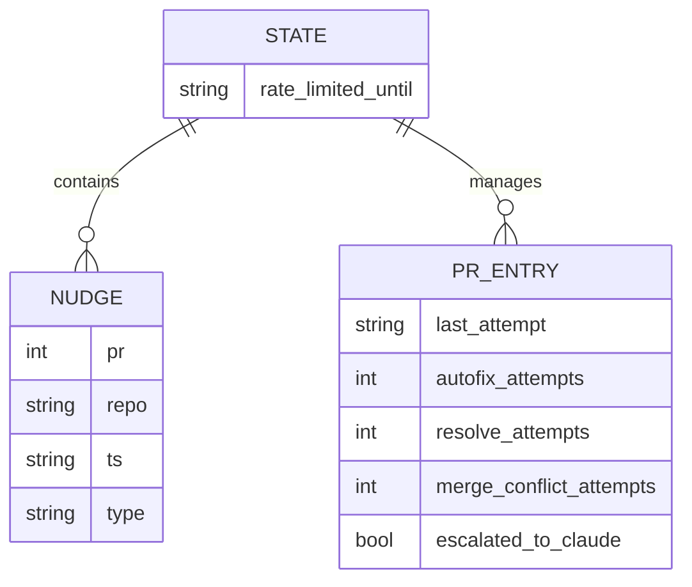
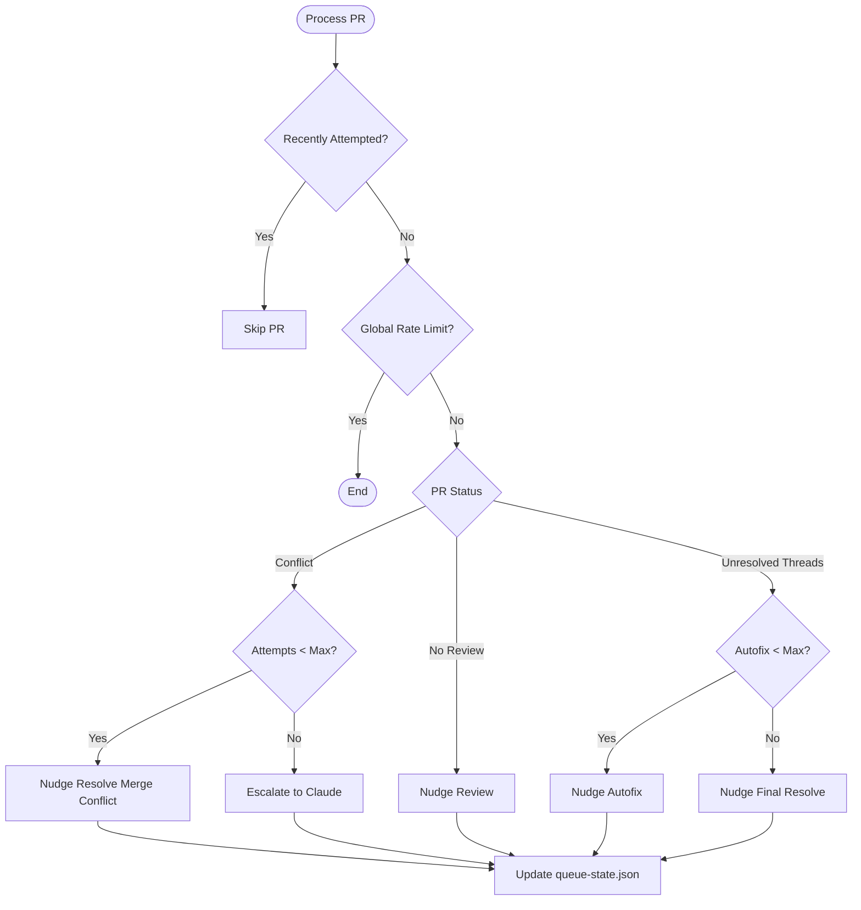

<details>
<summary>Relevant source files</summary>

The following files were used as context for generating this wiki page:

- [queue-state.json](queue-state.json)
- [README.md](README.md)
- [orchestrate.py](orchestrate.py)
- [requirements.txt](requirements.txt)
- [.github/workflows/orchestrate.yml](.github/workflows/orchestrate.yml) (referenced via orchestration logic)
</details>

# Queue State Schema

The **Queue State Schema** defines the structure of the `queue-state.json` file, which serves as the persistent ledger for the CodeRabbit orchestrator. This schema is critical for managing the account-wide review quota of 5 reviews per hour across multiple repositories. By tracking every nudge sent to CodeRabbit, the system prevents gridlock and ensures that pull requests (PRs) are processed within a strict budget of 4 nudges per rolling 60 minutes.

Sources: [README.md:1-15](README.md#L1-L15), [orchestrate.py:10-22](orchestrate.py#L10-L22)

## Core Data Structure

The state is stored as a JSON object containing three primary keys: `nudges`, `prs`, and `rate_limited_until`. This structure allows the orchestrator to perform historical lookups of actions, track per-PR attempt counters, and enforce global backoff periods when external rate limits are detected.

### Schema Entity Relationship
The following diagram illustrates the relationship between the global tracking lists and individual Pull Request entries within the state file.



The `prs` object uses a composite key format `owner/repo#number` to map PRs to their specific metadata and counters.

Sources: [orchestrate.py:102-113](orchestrate.py#L102-L113), [queue-state.json:1-150](queue-state.json#L1-L150)

## Field Definitions

The schema supports both global state management and granular PR-level tracking to handle complex workflows like autofix retries and escalations.

| Field | Type | Description |
| :--- | :--- | :--- |
| `nudges` | Array | A chronological list of nudge events used to calculate the rolling hourly quota. |
| `prs` | Object | A dictionary where keys are PR identifiers (e.g., `blixten85/bastion#183`). |
| `rate_limited_until` | String | An ISO 8601 timestamp indicating when the account-wide rate limit expires. |
| `last_attempt` | String | The timestamp of the most recent action taken on a specific PR. |
| `autofix_attempts` | Integer | Counter for `@coderabbitai autofix` or `@cubic-dev-ai` fix attempts. |
| `resolve_attempts` | Integer | Counter for `@coderabbitai resolve` fallback attempts. |
| `merge_conflict_attempts` | Integer | Counter for merge conflict resolution nudges. |
| `escalated_to_claude` | Boolean | Flag indicating if the PR has been labeled with `ask-claude`. |

Sources: [orchestrate.py:118-140](orchestrate.py#L118-L140), [queue-state.json:20-60](queue-state.json#L20-L60)

## State Logic and Transitions

The orchestrator utilizes the schema to drive a state machine for each PR. This logic ensures that actions progress from simple reviews to automated fixes, and finally to human or advanced AI escalation if automated tools fail.

### PR Processing Flow
The logic for updating the state based on repository feedback and previous attempts is visualized below:



When an action is taken, the `record_nudge` function updates the `nudges` list and increments the corresponding counter in the `prs` entry.

Sources: [orchestrate.py:126-140](orchestrate.py#L126-L140), [orchestrate.py:460-550](orchestrate.py#L460-L550)

## Quota and Backoff Management

The schema specifically tracks timestamps to enforce safety margins. The orchestrator maintains a `QUOTA_PER_HOUR` of 4, which is checked against the entries in the `nudges` array.

*  **Pruning:** Entries older than `QUOTA_WINDOW_MINUTES` (60) are removed from the `nudges` list during each run to maintain an accurate rolling window.
*  **External Rate Limits:** If a PR comment matches the `RATE_LIMIT_PATTERN`, the `rate_limited_until` field is updated with an authoritative deadline provided by CodeRabbit.

Sources: [orchestrate.py:82-84](orchestrate.py#L82-L84), [orchestrate.py:121-124](orchestrate.py#L121-L124), [orchestrate.py:202-218](orchestrate.py#L202-L218)

## Implementation Example
The following JSON snippet illustrates a PR entry that has exhausted its automated fix attempts and has been escalated.

```json
"blixten85/bastion#168": {
  "autofix_attempts": 2,
  "escalated_to_claude": true,
  "last_attempt": "2026-07-17T06:05:53.019065+00:00",
  "resolve_attempts": 1
}
```

Sources: [queue-state.json:25-30](queue-state.json#L25-L30)

## Summary
The **Queue State Schema** is the foundational data model that enables the `coderabbit-queue` to function as a stateless-yet-aware orchestrator. By persisting nudge history and PR-specific attempt counters in `queue-state.json`, the system successfully avoids exceeding CodeRabbit's account-wide review quotas while providing a structured path for PR resolution through automated retries and final escalations to Claude.

Sources: [README.md:15-25](README.md#L15-L25), [orchestrate.py:650-660](orchestrate.py#L650-L660)
