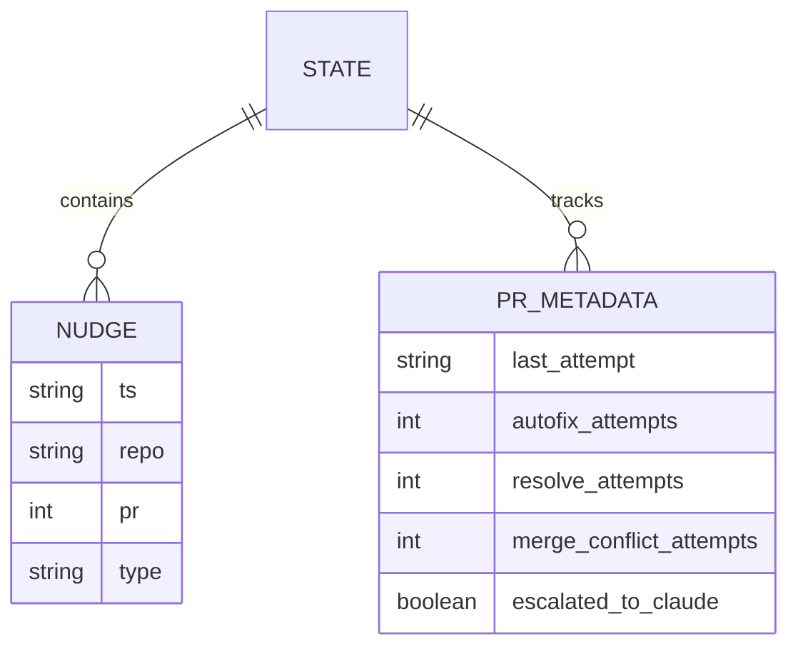
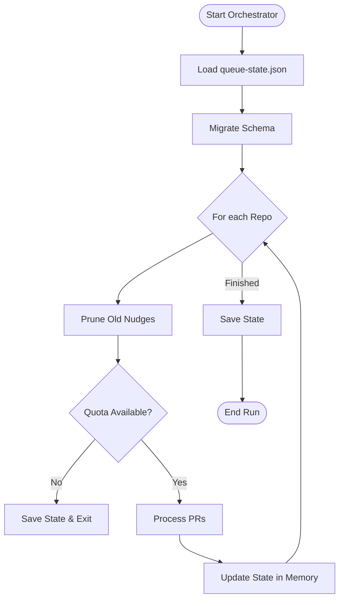

Relevant source files

The following files were used as context for generating this wiki page:

- [orchestrate.py](orchestrate.py)
- [queue-state.json](queue-state.json)
- [README.md](README.md)
- [requirements.txt](requirements.txt)
- [.github/workflows/orchestrate.yml](.github/workflows/orchestrate.yml) (Inferred from README.md documentation)

# State Read/Write Lifecycle

The State Read/Write Lifecycle in `coderabbit-queue` is a critical mechanism for maintaining a persistent, account-wide ledger of pull request (PR) interactions and API quota usage. Because CodeRabbit enforces a global limit of 5 reviews per hour across an entire account, this system tracks every "nudge" (interaction) sent by the orchestrator to ensure compliance with rate limits and to manage per-PR cooldowns and retry logic.

This lifecycle ensures that the orchestrator can stop execution immediately when a quota is exhausted and resume seamlessly in the next run by committing the updated state back to the repository. The primary storage for this state is `queue-state.json`, which acts as the single source of truth for the orchestrator's decision-making process.

Sources: [README.md:14-22](README.md#L14-L22), [orchestrate.py:10-18](orchestrate.py#L10-L18)

## State Storage and Schema

The project utilizes a JSON-based persistence model. The state is divided into three primary categories: tracking individual nudges for quota enforcement, maintaining per-PR metadata for retry/cooldown logic, and managing global rate-limit windows received from external services.

### Data Structure Overview

| Field | Type | Description |
| :--- | :--- | :--- |
| `nudges` | `List[Dict]` | A rolling log of actions taken, including timestamp (`ts`), repo, PR number, and nudge type. |
| `prs` | `Dict[str, Dict]` | Map of PR identifiers (e.g., `owner/repo#N`) to their specific attempt counts and escalation status. |
| `rate_limited_until` | `String (ISO)` | Global timestamp indicating when the account-wide CodeRabbit rate limit expires. |

Sources: [orchestrate.py:91-101](orchestrate.py#L91-L101), [queue-state.json:2-18](queue-state.json#L2-L18)

The diagram shows the relationship between the global state file and the historical logs versus specific PR trackers.
Sources: [orchestrate.py:126-140](orchestrate.py#L126-L140), [queue-state.json:20-40](queue-state.json#L20-L40)

## The Read/Write Flow

The lifecycle occurs within a single execution of the `orchestrate.py` script, typically triggered by a cron job or manual GitHub Action run.

### Initialization and Loading
At the start of a run, the system invokes `load_state()`. This function reads `queue-state.json` and performs a migration step to ensure historical data is compatible with the current schema, specifically seeding merge conflict counters from the nudge log if they are missing.

### Processing and State Mutation
As the orchestrator loops through repositories and PRs, it mutates the in-memory state object through several key functions:
*  `record_nudge()`: Appends a new entry to the `nudges` list and updates the `last_attempt` and relevant attempt counter for the specific PR.
*  `prune_nudges()`: Removes entries from the `nudges` log that are older than the `QUOTA_WINDOW_MINUTES` (60 minutes) to calculate remaining quota.
*  `detect_and_record_rate_limit()`: Scans PR comments for authoritative rate-limit messages from CodeRabbit and updates the global `rate_limited_until` field.

### Finalization and Persistence
The state is written back to `queue-state.json` using `save_state()` in two scenarios:
1.  **Early Exit:** If the global quota is exhausted mid-run.
2.  **Completion:** After all repositories have been processed.

Sources: [orchestrate.py:88-124](orchestrate.py#L88-L124), [orchestrate.py:157-175](orchestrate.py#L157-L175), [orchestrate.py:512-535](orchestrate.py#L512-L535)

The flow diagram illustrates the iterative state check and persistence logic used during a run.
Sources: [orchestrate.py:512-550](orchestrate.py#L512-L550)

## Logic for PR-Specific State

The system tracks specific counters for different types of interactions to prevent infinite loops and manage escalations to other tools (like Claude).

| Field in `prs` Object | Max Limit Constant | Purpose |
| :--- | :--- | :--- |
| `autofix_attempts` | `MAX_AUTOFIX_ATTEMPTS` (2) | Number of times `@coderabbitai autofix` has been requested. |
| `resolve_attempts` | `MAX_RESOLVE_ATTEMPTS` (1) | Fallback nudge to force resolution of threads. |
| `merge_conflict_attempts` | `MAX_MERGE_CONFLICT_ATTEMPTS` (2) | Nudges for merge conflict resolution before escalation. |
| `cubic_retry_attempts` | `MAX_CUBIC_RETRY_ATTEMPTS` (2) | Retries for transient Cubic AI command failures. |
| `escalated_to_claude` | N/A (Boolean) | Flag to prevent multiple `ask-claude` labels on a single PR. |

Sources: [orchestrate.py:65-71](orchestrate.py#L65-L71), [orchestrate.py:126-140](orchestrate.py#L126-L140), [orchestrate.py:461-480](orchestrate.py#L461-L480)

### Cooldown Implementation
The `recently_attempted()` function reads the `last_attempt` timestamp from the state for a given PR. If the difference between `now_utc()` and this timestamp is less than `PER_PR_COOLDOWN_MINUTES` (20 minutes), the PR is skipped to avoid hammering the same PR across sequential cycles.

Sources: [orchestrate.py:214-220](orchestrate.py#L214-L220), [orchestrate.py:417-420](orchestrate.py#L417-L420)

## External Rate Limit Integration

Unlike the heuristic quota tracking (based on the `nudges` list), the state also stores authoritative rate-limit data. If CodeRabbit responds to a nudge with a message like "... More reviews will be available in 21 minutes," the orchestrator parses this and sets the `rate_limited_until` field in the state. 

Subsequent PRs in the same run, and future runs occurring before that timestamp, will immediately skip all review-related nudges based on this state value.

Sources: [orchestrate.py:189-206](orchestrate.py#L189-L206), [orchestrate.py:422-431](orchestrate.py#L422-L431)

## Conclusion

The State Read/Write Lifecycle is the backbone of the `coderabbit-queue` orchestration strategy. By externalizing execution history and current limits into `queue-state.json`, the system transforms a stateless script into a state-aware agent capable of account-wide budget management, transient error recovery, and intelligent escalation. This persistence prevents the "gridlock" caused by multiple independent workflows and ensures that every interaction with CodeRabbit is intentional and rate-limited.
