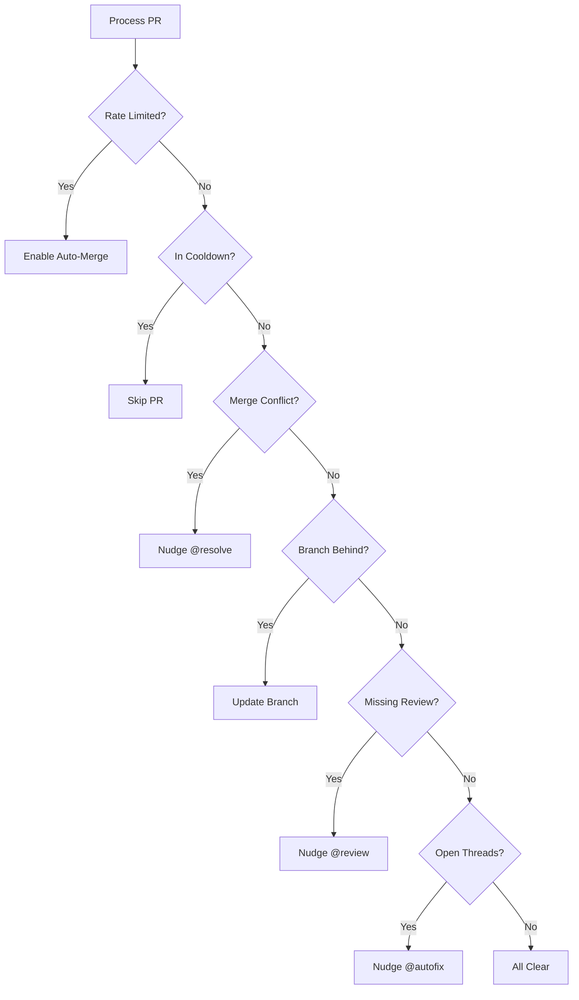

<details>
<summary>Relevant source files</summary>

The following files were used as context for generating this wiki page:

- [orchestrate.py](orchestrate.py)
- [README.md](README.md)
- [queue-state.json](queue-state.json)
- [requirements.txt](requirements.txt)
- [.github/workflows/orchestrate.yml](README.md) (Referenced in README)
</details>

# CodeRabbit (@coderabbitai) Integration

The CodeRabbit Integration serves as a central orchestrator designed to manage and nudge the `@coderabbitai` bot across multiple repositories. Its primary purpose is to circumvent account-wide rate limits (5 reviews per hour) by implementing a unified queue and budget system. This replaces fragmented, per-repo workflows that previously led to quota gridlock.

Sources: [README.md:1-12](README.md#L1-L12), [orchestrate.py:5-15](orchestrate.py#L5-L15)

## System Architecture

The integration operates as a single cron job that iterates through a hardcoded list of target repositories. It maintains a persistent state in `queue-state.json` to track nudges and enforce a safety budget of 4 nudges per rolling 60-minute window.

### Core Components
- **Orchestrator (`orchestrate.py`):** The logic engine that evaluates Pull Request (PR) states and issues commands.
- **State Ledger (`queue-state.json`):** A JSON database tracking historical nudges, PR-specific attempt counts, and global rate limit status.
- **GitHub CLI (`gh`):** The primary interface for interacting with the GitHub API, fetching PR details, and posting comments.

Sources: [README.md:14-25](README.md#L14-L25), [orchestrate.py:18-45](orchestrate.py#L18-L45), [queue-state.json:1-5](queue-state.json#L1-L5)

### Workflow Logic Diagram
The following diagram illustrates the decision-making process for a single PR within the orchestration loop.



Sources: [orchestrate.py:270-415](orchestrate.py#L270-L415)

## Budget and Rate Limiting

The system enforces strict limits to ensure reliable bot performance without hitting GitHub or CodeRabbit API caps.

| Parameter | Value | Description |
| :--- | :--- | :--- |
| `QUOTA_PER_HOUR` | 4 | Maximum nudges allowed per hour (Safety margin under 5/hr cap). |
| `QUOTA_WINDOW_MINUTES` | 60 | The rolling window for budget calculation. |
| `PER_PR_COOLDOWN_MINUTES` | 20 | Minimum time between nudges on the same PR. |
| `MAX_AUTOFIX_ATTEMPTS` | 2 | Limit for `@autofix` nudges before falling back to `@resolve`. |

Sources: [orchestrate.py:65-71](orchestrate.py#L65-L71)

### Dynamic Rate Limit Detection
Beyond internal tracking, the orchestrator scans PR comments for authoritative rate limit messages from CodeRabbit (e.g., "... More reviews will be available in X minutes"). When detected, the system sets a global `rate_limited_until` timestamp in the state file.

Sources: [orchestrate.py:102-108](orchestrate.py#L102-L108), [orchestrate.py:192-212](orchestrate.py#L192-L212)

## Command Integration

The orchestrator issues specific instructions to different AI agents based on the PR state.

### CodeRabbit Commands
- **`@coderabbitai review`**: Triggered when no review check or comment exists.
- **`@coderabbitai autofix`**: Triggered for unresolved threads opened by CodeRabbit.
- **`@coderabbitai resolve`**: Final fallback to force threads closed after autofix attempts are exhausted.
- **`@coderabbitai resolve merge conflict`**: Specifically targets PRs with the `CONFLICTING` mergeable state.

### Secondary Agent Support
- **Cubic (`@cubic-dev-ai`)**: Uses `fix this issue in this branch`. The orchestrator includes specific logic to retry cubic if it returns an "Unknown error".
- **Sentry Seer (`@sentry`)**: Uses `@sentry review` to trigger vulnerability and error scans.
- **Claude**: If all automated nudges fail, the system applies the `ask-claude` label as a final escalation path.

Sources: [orchestrate.py:76-96](orchestrate.py#L76-L96), [orchestrate.py:215-230](orchestrate.py#L215-L230), [orchestrate.py:380-410](orchestrate.py#L380-L410)

## Data Schema

The `queue-state.json` file persists the following structure:

```json
{
  "nudges": [
    {
      "pr": 183,
      "repo": "bastion",
      "ts": "2026-07-20T05:50:54.051301+00:00",
      "type": "resolve"
    }
  ],
  "prs": {
    "blixten85/repo#123": {
      "autofix_attempts": 2,
      "last_attempt": "ISO-TIMESTAMP",
      "escalated_to_claude": true
    }
  },
  "rate_limited_until": "ISO-TIMESTAMP"
}
```

Sources: [queue-state.json:1-30](queue-state.json#L1-L30), [orchestrate.py:118-132](orchestrate.py#L118-L132)

## Conclusion
The CodeRabbit Integration transforms decentralized PR management into a disciplined, quota-aware system. By centralizing the nudge logic and maintaining a rolling budget ledger, it ensures that all 16 target repositories receive timely AI reviews while remaining within the account's operational constraints.
