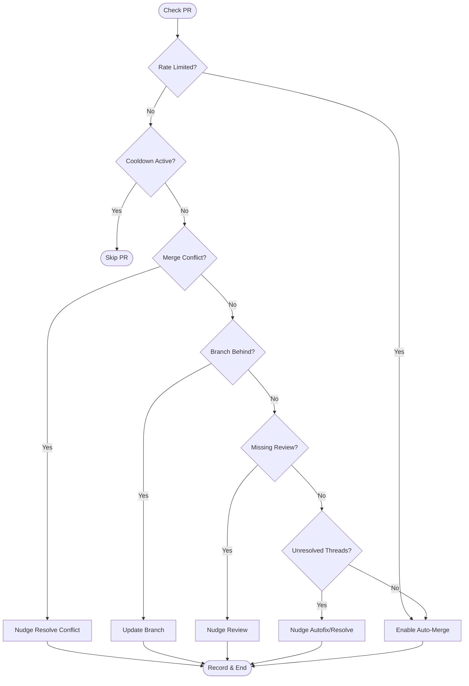

<details>
<summary>Relevant source files</summary>

The following files were used as context for generating this wiki page:

- [orchestrate.py](orchestrate.py)
- [README.md](README.md)
- [queue-state.json](queue-state.json)
- [requirements.txt](requirements.txt)
- [.github/workflows/orchestrate.yml](https://github.com/blixten85/coderabbit-queue/tree/ad441e798b4b4fb2dc5509a344c8a61a9557054a/.github/workflows) (Inferred from [README.md:18](README.md#L18))
</details>

# Review Generation & Nudging

Review Generation & Nudging is the core mechanism of the `coderabbit-queue` orchestrator. It manages account-wide interactions with AI code review tools—primarily CodeRabbit, but also Sentry Seer and Cubic—to ensure pull requests (PRs) across multiple repositories receive timely reviews and automated fixes without exceeding API rate limits. 

The system operates as a single cron job that centralizes decision-making logic previously dispersed across individual repositories. By tracking the state of "nudges" (commands sent to AI bots) in a persistent ledger, it enforces a strict global budget and PR-specific cooldowns to prevent gridlock caused by overlapping requests.

Sources: [README.md:1-25](README.md#L1-L25), [orchestrate.py:1-15](orchestrate.py#L1-L15)

## Core Logic and Priority Ranking

The orchestration logic follows a strict priority hierarchy when evaluating an open PR. Only one major action is taken per PR in a single execution cycle to preserve the global quota.

### Action Priority Hierarchy
1.  **Merge Conflicts**: If a PR is in a conflicting state, the orchestrator attempts to trigger a resolution.
2.  **Missing Reviews**: If no review or status check from CodeRabbit or Sentry exists, a review is requested.
3.  **Outdated Branches**: If the branch is behind its base, it is updated to trigger automatic re-reviews.
4.  **Unresolved Threads**: If review comments exist but remain open, the orchestrator attempts to trigger an "autofix" or a final "resolve" fallback.
5.  **Auto-Merge**: If all checks are clear, the system ensures GitHub's auto-merge feature is enabled.

Sources: [README.md:20-22](README.md#L20-L22), [orchestrate.py:442-550](orchestrate.py#L442-L550)

### Decision Flow Diagram
This diagram illustrates how the `process_pr` function evaluates the state of a pull request and selects the appropriate nudge or maintenance action.



Sources: [orchestrate.py:442-550](orchestrate.py#L442-L550)

## Quota Management & Rate Limiting

The system manages a shared account-wide quota to avoid the 5 reviews per hour limit imposed by CodeRabbit.

### Configuration Parameters
| Parameter | Value | Description |
| :--- | :--- | :--- |
| `QUOTA_PER_HOUR` | 4 | Safety margin under the real 5/hour cap. |
| `QUOTA_WINDOW_MINUTES` | 60 | The rolling window for tracking nudges. |
| `PER_PR_COOLDOWN_MINUTES` | 20 | Prevents hammering the same PR every cycle. |
| `MAX_AUTOFIX_ATTEMPTS` | 2 | Limit on AI-suggested code fixes. |
| `MAX_RESOLVE_ATTEMPTS` | 1 | Final fallback to force-close threads. |

Sources: [orchestrate.py:53-57](orchestrate.py#L53-L57), [README.md:23-24](README.md#L23-L24)

### Rate Limit Detection
The orchestrator uses two methods to detect rate limits:
1.  **Heuristic Ledger**: Tracking nudges sent in the last 60 minutes within `queue-state.json`.
2.  **Authoritative Detection**: Scanning PR comments for specific strings like `"... More reviews will be available in X minutes."` using `RATE_LIMIT_PATTERN`.

Sources: [orchestrate.py:88-91](orchestrate.py#L88-L91), [orchestrate.py:214-233](orchestrate.py#L214-L233), [queue-state.json:1-150](queue-state.json#L1-L150)

## Bot-Specific Commands

The system issues specific commands tailored to different AI review agents.

### Nudge Commands Table
| Command Constant | Command Text | Target Agent |
| :--- | :--- | :--- |
| `NUDGE_MERGE_CONFLICT` | `@coderabbitai resolve merge conflict` | CodeRabbit |
| `NUDGE_REVIEW` | `@coderabbitai review` | CodeRabbit |
| `NUDGE_AUTOFIX` | `@coderabbitai autofix` | CodeRabbit |
| `NUDGE_SENTRY_REVIEW` | `@sentry review` | Sentry Seer |
| `NUDGE_CUBIC_AUTOFIX` | `@cubic-dev-ai fix this issue in this branch` | Cubic |
| `NUDGE_RESOLVE` | `@coderabbitai resolve` | CodeRabbit (Fallback) |

Sources: [orchestrate.py:62-83](orchestrate.py#L62-L83)

### Escalation Path
When automated nudges fail (e.g., after `MAX_AUTOFIX_ATTEMPTS` or `MAX_MERGE_CONFLICT_ATTEMPTS` are reached), the system escalates the PR to a human or a more advanced model by adding the `ask-claude` label. This is a one-way, one-time escalation to prevent infinite loops and cost incidents.

Sources: [orchestrate.py:382-398](orchestrate.py#L382-L398), [orchestrate.py:481-490](orchestrate.py#L481-L490)

## State Persistence

The orchestrator relies on `queue-state.json` to maintain context between GitHub Action runs. This file tracks:
-  **Nudges**: A list of recent actions with timestamps, repo names, and PR numbers.
-  **PR Metadata**: Cumulative attempt counts for autofixes, merges, and cubic retries per PR.
-  **Global Backoff**: The `rate_limited_until` timestamp that pauses all review nudges across the account.

```json
{
  "nudges": [
    { "pr": 11, "repo": "ops-hub", "ts": "2026-07-20T05:51:01...", "type": "review" }
  ],
  "prs": {
    "blixten85/bastion#183": {
      "autofix_attempts": 2,
      "resolve_attempts": 1
    }
  },
  "rate_limited_until": "2026-07-16T06:28:09..."
}
```

Sources: [queue-state.json:1-10](queue-state.json#L1-L10), [orchestrate.py:100-118](orchestrate.py#L100-L118)

## Conclusion
The Review Generation & Nudging system transforms uncoordinated repository workflows into a disciplined, quota-aware orchestration layer. By prioritizing critical blockers like merge conflicts and branch updates before requesting new reviews, it ensures that the limited AI review capacity is utilized on PRs that are actually ready for feedback.
