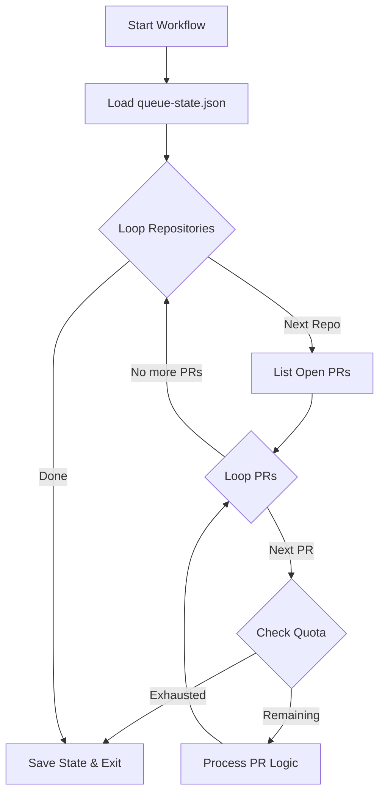
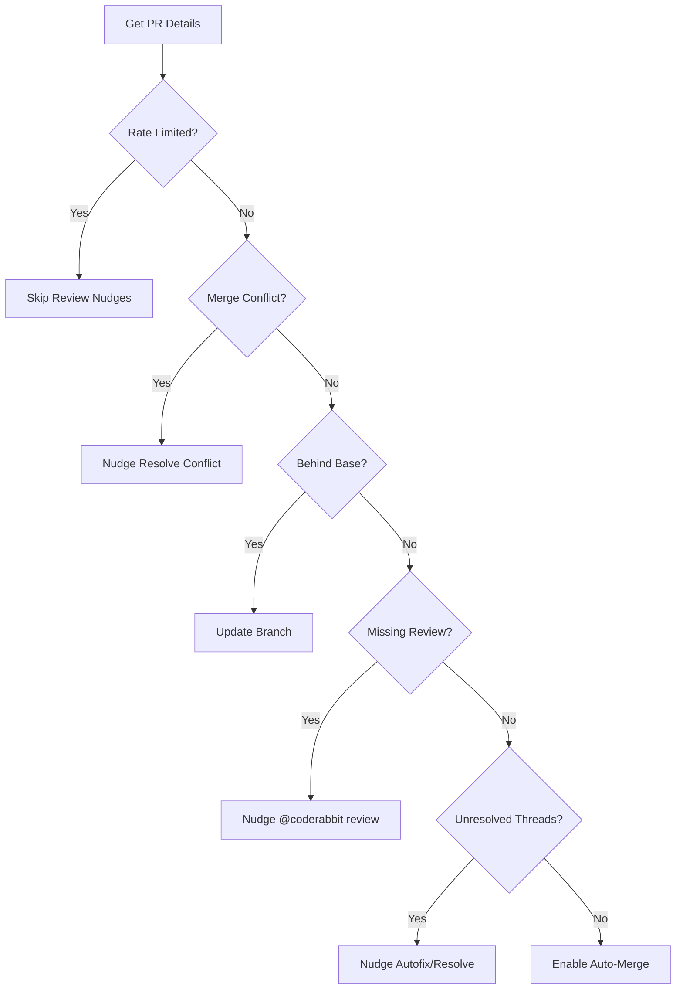

<details>
<summary>Relevant source files</summary>

The following files were used as context for generating this wiki page:

- [README.md](README.md)
- [orchestrate.py](orchestrate.py)
- [queue-state.json](queue-state.json)
- [requirements.txt](requirements.txt)
- [.github/workflows/orchestrate.yml](README.md) (Referenced in README.md)

</details>

# Cron Job Setup

The Cron Job Setup in the `coderabbit-queue` repository serves as a centralized, account-wide orchestrator designed to manage interactions with CodeRabbit (`@coderabbitai`) across multiple GitHub repositories. Its primary purpose is to bypass the limitations of CodeRabbit's account-wide review quota (5 reviews per hour) by replacing individual, per-repo workflows with a single, coordinated process.

This system ensures that pull requests (PRs) across the `blixten85` organization are nudged for review or resolution in a controlled manner, preventing the "gridlock" caused by multiple repositories independently exhausting the shared quota. It enforces a strict budget of 4 nudges per rolling 60 minutes and tracks all activity in a persistent state file to maintain continuity between runs.

Sources: [README.md:1-24](README.md#L1-L24), [orchestrate.py:5-15](orchestrate.py#L5-L15)

## System Architecture and Workflow

The orchestrator is implemented as a Python script (`orchestrate.py`) triggered by a GitHub Actions cron job defined in `.github/workflows/orchestrate.yml`. It follows a specific logic flow to process target repositories and their open pull requests.

### High-Level Execution Flow

The following diagram illustrates the sequence of operations performed during a single execution of the orchestrator.



The workflow iterates through a hardcoded list of repositories, checks the global quota before every action, and processes each PR based on priority.
Sources: [orchestrate.py:570-610](orchestrate.py#L570-L610), [README.md:17-24](README.md#L17-L24)

## Core Components and Configuration

### Target Repositories
The orchestrator targets a specific set of 16 repositories owned by `blixten85`, ranging from infrastructure tools like `bastion` to web applications like `politiker-webapp`.
Sources: [orchestrate.py:46-64](orchestrate.py#L46-L64), [README.md:26-31](README.md#L26-L31)

### Quota and Cooldown Management
The system defines strict constants to prevent rate-limiting and ensure fair processing across PRs.

| Configuration Constant | Value | Description |
| :--- | :--- | :--- |
| `QUOTA_PER_HOUR` | 4 | Max nudges per rolling 60 minutes (Safety margin under 5/hr cap). |
| `QUOTA_WINDOW_MINUTES` | 60 | The time window for the rolling quota. |
| `PER_PR_COOLDOWN_MINUTES` | 20 | Minimum time between nudges for the same PR. |
| `MAX_AUTOFIX_ATTEMPTS` | 2 | Max tries for `@coderabbitai autofix` before falling back. |
| `MAX_RESOLVE_ATTEMPTS` | 1 | Final fallback attempt using `@coderabbitai resolve`. |

Sources: [orchestrate.py:68-73](orchestrate.py#L68-L73), [README.md:20-22](README.md#L20-L22)

## PR Processing Logic

The logic for handling individual PRs is prioritized based on the current state of the PR. The goal is to move the PR toward a mergeable state with minimal human intervention.

### Decision Tree for Nudges



The decision tree prioritizes blocking issues like merge conflicts and outdated branches before requesting new reviews or triggering autofixes.
Sources: [orchestrate.py:421-567](orchestrate.py#L421-L567), [README.md:17-19](README.md#L17-L19)

### Nudge Commands
The system utilizes specific commands to interact with various AI agents:
*  **CodeRabbit:** `@coderabbitai review`, `@coderabbitai autofix`, `@coderabbitai resolve`, and `@coderabbitai resolve merge conflict`.
*  **Sentry Seer:** `@sentry review`.
*  **Cubic:** `@cubic-dev-ai fix this issue in this branch`.

Sources: [orchestrate.py:78-100](orchestrate.py#L78-L100)

## State Management

Persistence is handled via `queue-state.json`. This file tracks:
1.  **Nudges:** A list of recent nudge events (timestamp, repo, PR, and type).
2.  **PRs:** Historical data for specific PRs, including attempt counts and escalation status.
3.  **Rate Limit:** An authoritative timestamp indicating when the system should back off based on CodeRabbit's feedback.

### State Schema Example

```json
{
  "nudges": [{"ts": "2026-07-20T...", "repo": "bastion", "pr": 183, "type": "resolve"}],
  "prs": {
    "blixten85/bastion#168": {
      "autofix_attempts": 2,
      "escalated_to_claude": true,
      "last_attempt": "2026-07-17T..."
    }
  },
  "rate_limited_until": "2026-07-16T..."
}
```

Sources: [queue-state.json:1-20](queue-state.json#L1-L20), [orchestrate.py:121-135](orchestrate.py#L121-L135)

## Error Handling and Monitoring

The system integrates with **Sentry** for real-time error tracking and performance profiling. It uses the `sentry-sdk` to capture exceptions during the orchestration run.

### Escalation Policy
When the orchestrator exhausts its defined attempts for automated fixes or merge conflict resolutions, it applies the `ask-claude` label to the PR. This serves as a "last resort" to involve a more capable agent or human intervention, preventing infinite loops and wasted quota.
Sources: [orchestrate.py:27-41](orchestrate.py#L27-L41), [orchestrate.py:370-388](orchestrate.py#L370-L388), [requirements.txt:1](requirements.txt#L1)

## Conclusion

The Cron Job Setup effectively centralizes PR management for the `blixten85` organization. By replacing distributed workflows with a single, state-aware orchestrator, the project maintains a steady flow of automated code reviews while respecting account-wide API quotas. The use of persistent state and tiered escalation ensures that the system is both robust and efficient in handling complex PR states across 16 repositories.
