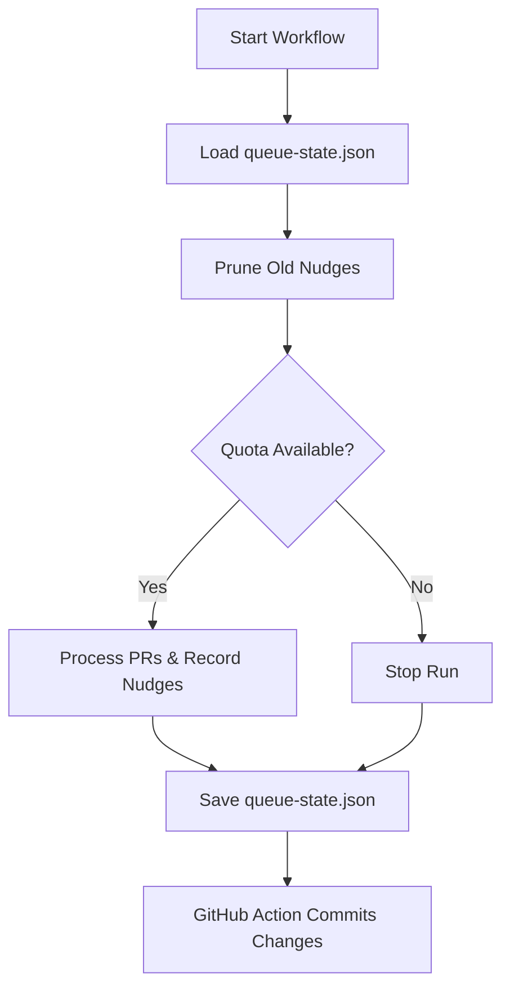

Relevant source files

The following files were used as context for generating this wiki page:

- [README.md](README.md)
- [orchestrate.py](orchestrate.py)
- [queue-state.json](queue-state.json)
- [requirements.txt](requirements.txt)
- [.github/workflows/orchestrate.yml](README.md) (Referenced via README)

# Automated State Git Commits

Automated State Git Commits refer to the mechanism by which the `coderabbit-queue` orchestrator persists its operational state back to the repository. This process ensures that data regarding review quotas, per-PR cooldowns, and attempt counters is maintained across different GitHub Action runs. The orchestrator tracks every "nudge" (interaction) sent to CodeRabbit or other AI bots in a local file named `queue-state.json`, which is then committed to the main repository by the CI workflow.

Sources: [README.md:20-23](README.md#L20-L23), [orchestrate.py:53-54](orchestrate.py#L53-L54)

This system replaces decentralized per-repo workflows with a single source of truth. By committing state changes back to the repository, the orchestrator enforces a strict account-wide budget (4 nudges per rolling 60 minutes) and prevents redundant actions on the same Pull Request within a short timeframe.

Sources: [README.md:12-25](README.md#L12-L25), [orchestrate.py:12-20](orchestrate.py#L12-L20)

## State Persistence Architecture

The orchestrator relies on a JSON-based ledger to manage cross-repository coordination. The lifecycle of this state involves loading existing data, recording new interactions, and saving the updated ledger for the next Git commit.

### Data Flow for State Persistence

The following diagram illustrates how the state is managed during an orchestrator execution:

The orchestrator reads the current state at the beginning of a run and ensures any updates are written back to the filesystem before the workflow completes.
Sources: [orchestrate.py:100-112](orchestrate.py#L100-L112), [orchestrate.py:535-568](orchestrate.py#L535-L568), [README.md:43-46](README.md#L43-L46)

## The State Schema (`queue-state.json`)

The `queue-state.json` file serves as the database for the system. It tracks three primary categories of information: the history of nudges, specific Pull Request attempt data, and global rate-limiting status.

### Key Data Structures

| Field | Type | Description |
| :--- | :--- | :--- |
| `nudges` | List[Object] | A list of recent interactions containing timestamp (`ts`), `repo`, `pr` number, and nudge `type`. |
| `prs` | Object | Map of PR keys (e.g., `owner/repo#N`) to attempt counters and cooldown timestamps. |
| `rate_limited_until` | String (ISO) | A timestamp indicating a global backoff period triggered by CodeRabbit's own rate limit signals. |

Sources: [orchestrate.py:107-110](orchestrate.py#L107-L110), [queue-state.json:1-8](queue-state.json#L1-L8)

### PR-Specific Tracking Fields

Within the `prs` object, the system tracks specific metrics to avoid infinite loops and over-budgeting:
*  `last_attempt`: ISO timestamp of the last interaction to enforce the `PER_PR_COOLDOWN_MINUTES`.
*  `autofix_attempts`: Number of times `@coderabbitai autofix` or `@cubic-dev-ai` was called.
*  `resolve_attempts`: Counter for the final `@coderabbitai resolve` fallback.
*  `merge_conflict_attempts`: Counter for `@coderabbitai resolve merge conflict` nudges.
*  `escalated_to_claude`: Boolean flag to ensure a PR is only escalated to the "ask-claude" label once.

Sources: [orchestrate.py:133-146](orchestrate.py#L133-L146), [queue-state.json:11-26](queue-state.json#L11-L26)

## Logic and State Transitions

The orchestrator utilizes specific functions to modify the state in memory before it is committed to Git.

### State Modification Functions

*  **`record_nudge(state, repo, pr_number, nudge_type)`**: The primary function for updating the state. It appends a nudge record and increments relevant attempt counters based on the nudge type.
  Sources: [orchestrate.py:133-146](orchestrate.py#L133-L146)
*  **`prune_nudges(state)`**: Removes nudges from the state that are older than `QUOTA_WINDOW_MINUTES` (60 minutes). This ensures the `quota_remaining` calculation only considers recent activity.
  Sources: [orchestrate.py:124-126](orchestrate.py#L124-L126)
*  **`detect_and_record_rate_limit(state, details)`**: Scans PR comments for authoritative rate-limit messages from CodeRabbit (e.g., "More reviews will be available in X minutes") and updates the `rate_limited_until` field.
  Sources: [orchestrate.py:202-224](orchestrate.py#L202-L224)

### State Migration logic
The system includes a `migrate_merge_conflict_attempts` function that seeds the merge conflict counter from existing nudge history to ensure continuity when new counters are introduced to the schema.
Sources: [orchestrate.py:112-121](orchestrate.py#L112-L121)

## Automated Commitment Process

While the Python script (`orchestrate.py`) handles the logic of updating the JSON file, the actual "Git Commit" part of "Automated State Git Commits" is performed by the GitHub Actions environment.

1.  **Execution**: The `.github/workflows/orchestrate.yml` cron job runs the orchestrator.
2.  **File Update**: `orchestrate.py` writes changes to `queue-state.json` via `save_state()`.
3.  **Commit/Push**: The workflow step (as described in the README) handles the Git staging, committing, and pushing of the updated `queue-state.json` back to the `blixten85/coderabbit-queue` repository.

Sources: [README.md:16-23](README.md#L16-L23), [README.md:43-46](README.md#L43-L46), [orchestrate.py:566-568](orchestrate.py#L566-L568)

## Summary

Automated State Git Commits provide the persistent memory required for the CodeRabbit orchestrator to function as a centralized gatekeeper. By tracking every interaction in `queue-state.json` and committing it back to the repository, the system successfully maintains a global account-wide quota, enforces per-PR cooldowns, and manages complex escalation paths across 16 different target repositories.
