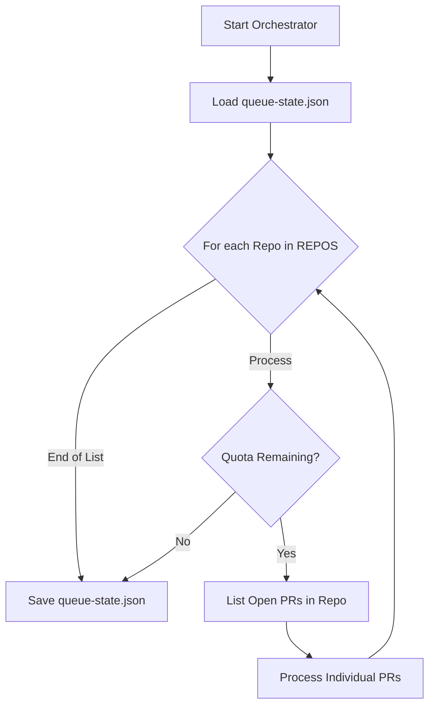
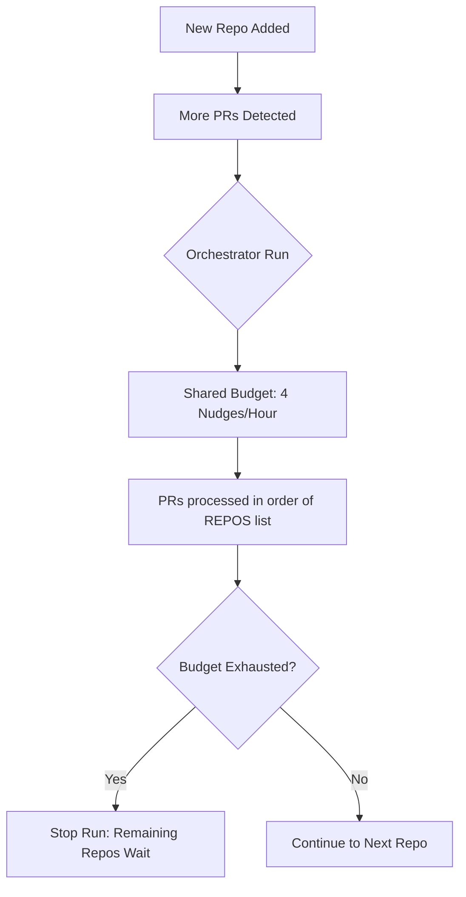

<details>
<summary>Relevant source files</summary>

The following files were used as context for generating this wiki page:

- [orchestrate.py](orchestrate.py)
- [README.md](README.md)
- [queue-state.json](queue-state.json)
- [requirements.txt](requirements.txt)
- [.github/workflows/orchestrate.yml](.github/workflows/orchestrate.yml) (referenced via README.md)

</details>

# Adding or Removing Repositories

The `coderabbit-queue` system acts as a central orchestrator to manage account-wide review quotas for CodeRabbit across multiple repositories. Adding or removing a repository involves modifying the hardcoded configuration within the orchestration script to ensure the centralized cron job includes or excludes specific targets during its execution cycle.

This centralized approach replaces legacy per-repo workflows (e.g., `coderabbit-rewake.yml`), providing a single source of truth for nudging logic and budget enforcement. By maintaining a hardcoded list, the system ensures that the shared budget of 4 nudges per rolling 60 minutes is strictly applied to the intended set of repositories.

Sources: [README.md:3-17](README.md#L3-L17), [orchestrate.py:10-20](orchestrate.py#L10-L20)

## Configuration Management

The list of repositories managed by the orchestrator is defined as a static list in the `orchestrate.py` script. This list determines which repositories the `main()` function iterates over during each run.

### The REPOS List
To add a new repository, its name must be appended to the `REPOS` list. To remove one, its name should be deleted from the list. The `OWNER` variable (set to `blixten85`) is prepended to these names during API calls.

```python
OWNER = "blixten85"
REPOS = [
    "bastion",
    "scraper",
    "routines-relay",
    "ops-hub",
    "product-describer",
    "docker-idempotent-update",
    "plex_clear_watchlist",
    "pastebinit",
    "politiker-kontakter",
    "politiker-webapp",
    "filtered-movies",
    "product-describer-cloudflare",
    "repo-standard",
    "bastion-certificates",
    "renovate-runner",
    "secrets-rotation",
]
```

Sources: [orchestrate.py:40-61](orchestrate.py#L40-L61)

### Data Flow for Repository Processing
The following diagram illustrates how the `REPOS` configuration drives the orchestration logic:



The orchestrator loops through the `REPOS` list and checks the global quota before processing each repository.
Sources: [orchestrate.py:539-569](orchestrate.py#L539-L569)

## Operational Requirements

When adding a new repository to the orchestrator, several infrastructure and state considerations must be addressed to ensure successful integration.

### GitHub Permissions
The `GH_TOKEN` (or `CR_QUEUE_TOKEN` in GitHub Actions) must have Read/Write access for Pull Requests across all repositories listed in `REPOS`. This is critical for the `gh pr list`, `gh pr view`, and `gh pr comment` commands to function.

Sources: [README.md:37-43](README.md#L37-L43), [orchestrate.py:22-25](orchestrate.py#L22-L25)

### State Persistence
When a repository is added and processed, the system automatically begins tracking its PRs in `queue-state.json`. The state file uses a unique key format of `owner/repo#number` to distinguish between different repositories.

| Field | Description | Source |
| :--- | :--- | :--- |
| `nudges` | A list of recent nudge events across all repos for quota tracking. | [queue-state.json:2-24](queue-state.json#L2-L24) |
| `prs` | A map of specific PR states, indexed by `blixten85/repo-name#PR_ID`. | [queue-state.json:25-27](queue-state.json#L25-L27) |
| `last_attempt` | ISO timestamp of the last nudge for a specific PR in a repo. | [orchestrate.py:117-120](orchestrate.py#L117-L120) |

Sources: [queue-state.json:2-25](queue-state.json#L2-L25), [orchestrate.py:116-120](orchestrate.py#L116-L120)

### Removal Cleanup
When removing a repository from the `REPOS` list, it is recommended to also remove the legacy `coderabbit-rewake.yml` workflow from that specific repository if it still exists, as the central orchestrator was designed to replace these per-repo files to prevent gridlock.

Sources: [README.md:47-50](README.md#L47-L50)

## Impact on Quota and Budgeting

Adding repositories increases the potential demand on the shared quota. The orchestrator enforces a hard limit regardless of how many repositories are configured.



The global budget is a "safety margin" under the real 5/hour CodeRabbit cap to prevent account-wide gridlock.
Sources: [README.md:19-27](README.md#L19-L27), [orchestrate.py:64-65](orchestrate.py#L64-L65)

## Summary of Steps

| Action | Technical Task | File Reference |
| :--- | :--- | :--- |
| **Add Repository** | Add string to `REPOS` list in `orchestrate.py`. | [orchestrate.py:42-61](orchestrate.py#L42-L61) |
| **Remove Repository** | Delete string from `REPOS` list in `orchestrate.py`. | [orchestrate.py:42-61](orchestrate.py#L42-L61) |
| **Verify Access** | Ensure `GH_TOKEN` has scopes for the new repo. | [README.md:37-43](README.md#L37-L43) |
| **Decommission Old Workflows** | Delete `coderabbit-rewake.yml` from target repo. | [README.md:47-50](README.md#L47-L50) |

Managing repositories in `coderabbit-queue` is a centralized configuration task. By modifying the `REPOS` list in `orchestrate.py`, developers control the scope of the account-wide nudge orchestration, ensuring that all target projects benefit from the shared rate-limiting and priority logic while avoiding API exhaustion.
