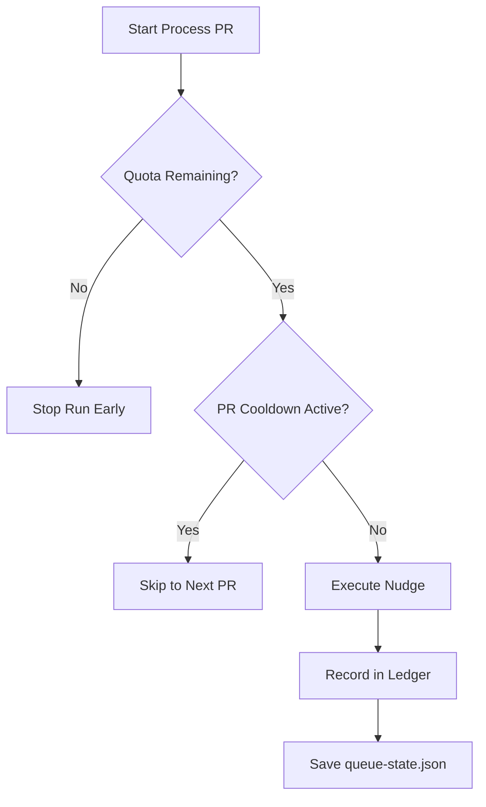
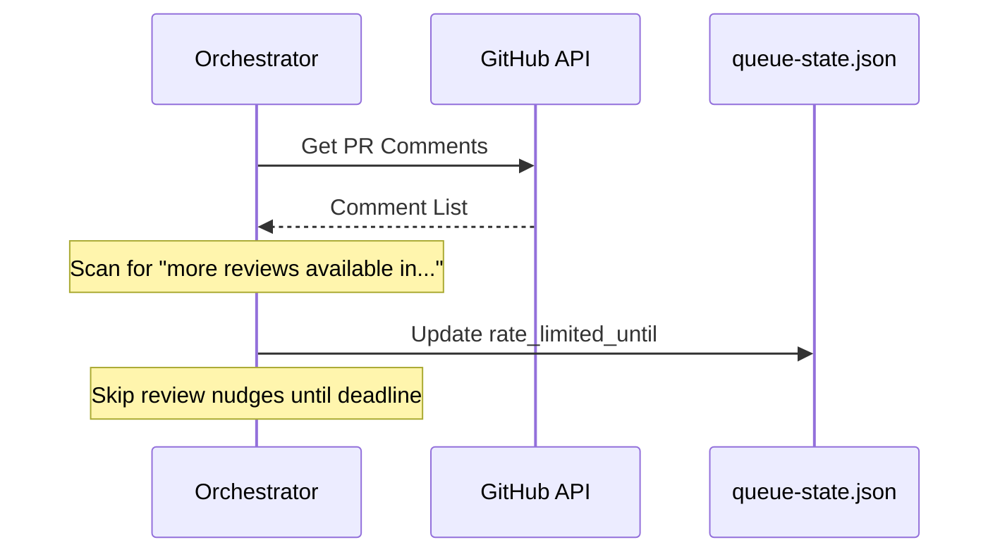

Relevant source files

The following files were used as context for generating this wiki page:

- [orchestrate.py](orchestrate.py)
- [README.md](README.md)
- [queue-state.json](queue-state.json)
- [requirements.txt](requirements.txt)
- [.github/workflows/orchestrate.yml](.github/workflows/orchestrate.yml) (referenced via README.md)

# Adjusting Rate Limits & Cooldowns

The `coderabbit-queue` project implements a centralized orchestration layer to manage interactions with CodeRabbit and other AI agents across multiple repositories. Its primary purpose is to stay within account-wide review quotas (typically 5 reviews per hour) and prevent "gridlock" caused by independent workflows competing for the same limited resources.

This system employs two layers of protection: a self-tracked shared budget (ledger) and an authoritative detection mechanism that reads actual rate-limit messages from bot comments. By adjusting these limits and cooldowns, developers can fine-tune how aggressively the orchestrator nudges pull requests (PRs) for reviews, autofixes, or conflict resolutions.

Sources: [README.md:7-15](README.md#L7-L15), [orchestrate.py:10-20](orchestrate.py#L10-L20)

## Global Rate Limit Configuration

The global rate limit is governed by two primary constants that define the "budget" of nudges allowed within a specific time window. The system is designed to provide a safety margin under the actual service provider limits.

### Budget Constants
- **`QUOTA_PER_HOUR`**: Defines the number of nudges allowed in the rolling window. Currently set to `4` to remain under the 5/hour cap.
- **`QUOTA_WINDOW_MINUTES`**: The duration of the rolling window, set to `60` minutes.

Sources: [orchestrate.py:72-73](orchestrate.py#L72-L73)

### The Quota Ledger
The system maintains a rolling ledger of nudges in `queue-state.json`. Before every potential action, the orchestrator calculates the remaining quota by pruning entries older than the `QUOTA_WINDOW_MINUTES`.

The diagram shows the decision flow used to protect global and per-PR limits. 
Sources: [orchestrate.py:108-115](orchestrate.py#L108-L115), [orchestrate.py:465-475](orchestrate.py#L465-L475)

## Per-PR Cooldowns and Retries

To avoid "hammering" a single pull request in every execution cycle, the system enforces a `PER_PR_COOLDOWN_MINUTES` (currently 20 minutes). If a PR has been nudged within this window, the orchestrator skips it until the time has elapsed.

### Attempt Limits
Beyond time-based cooldowns, the system limits the number of times specific actions are attempted before escalating to a human or a more capable model (Claude).

| Parameter | Default Value | Description |
| :--- | :--- | :--- |
| `PER_PR_COOLDOWN_MINUTES` | 20 | Minutes to wait between nudges on the same PR. |
| `MAX_AUTOFIX_ATTEMPTS` | 2 | Max tries for `@coderabbitai autofix` before falling back. |
| `MAX_RESOLVE_ATTEMPTS` | 1 | Final fallback to `@coderabbitai resolve` to clear threads. |
| `MAX_MERGE_CONFLICT_ATTEMPTS` | 2 | Max nudges for `@coderabbitai resolve merge conflict`. |
| `MAX_CUBIC_RETRY_ATTEMPTS` | 2 | Retries for transient "cubic command failed" errors. |

Sources: [orchestrate.py:74-79](orchestrate.py#L74-L79), [orchestrate.py:228-234](orchestrate.py#L228-L234)

## Authoritative Rate Limit Detection

The orchestrator does not solely rely on its internal ledger. It actively scans PR comments for specific patterns from CodeRabbit that indicate a service-side rate limit hit.

### Pattern Matching
The system uses `RATE_LIMIT_PATTERN` to extract wait times directly from bot responses:
`"... More reviews will be available in 21 minutes."`

### Handling Service-Side Backoff
When a limit is detected, the `detect_and_record_rate_limit` function calculates a `deadline` and updates the `rate_limited_until` field in `queue-state.json`. The orchestrator will then skip all review-related nudges until this deadline passes, although it may still perform non-quota-consuming tasks like enabling auto-merge.

The sequence diagram illustrates how the authoritative rate limit status is retrieved and stored.
Sources: [orchestrate.py:102-106](orchestrate.py#L102-L106), [orchestrate.py:192-211](orchestrate.py#L192-L211)

## State Persistence

The `queue-state.json` file serves as the persistent memory for the system. It tracks the timestamp and type of every nudge, as well as the attempt counts for individual PRs.

### Data Structure
- `nudges`: A list of objects containing `ts` (timestamp), `repo`, `pr`, and `type`.
- `prs`: A dictionary keyed by `owner/repo#N` containing `last_attempt`, `autofix_attempts`, and `merge_conflict_attempts`.
- `rate_limited_until`: A global ISO timestamp indicating when service-side throttling expires.

Sources: [orchestrate.py:126-135](orchestrate.py#L126-L135), [queue-state.json:1-70](queue-state.json#L1-L70)

### Escalation Logic
Once `MAX_AUTOFIX_ATTEMPTS` or `MAX_MERGE_CONFLICT_ATTEMPTS` are reached, the system ceases standard nudging and applies the `ask-claude` label to the PR. This is a one-way escalation designed to prevent infinite loops and associated costs.

Sources: [orchestrate.py:321-332](orchestrate.py#L321-L332), [orchestrate.py:440-455](orchestrate.py#L440-L455)

## Conclusion
Adjusting rate limits and cooldowns in this project involves modifying constants in `orchestrate.py`. The architecture ensures that even if local configurations are set aggressively, the system will back off upon detecting authoritative rate-limit messages from the AI provider, thus maintaining a stable and predictable review flow across the entire organization.
