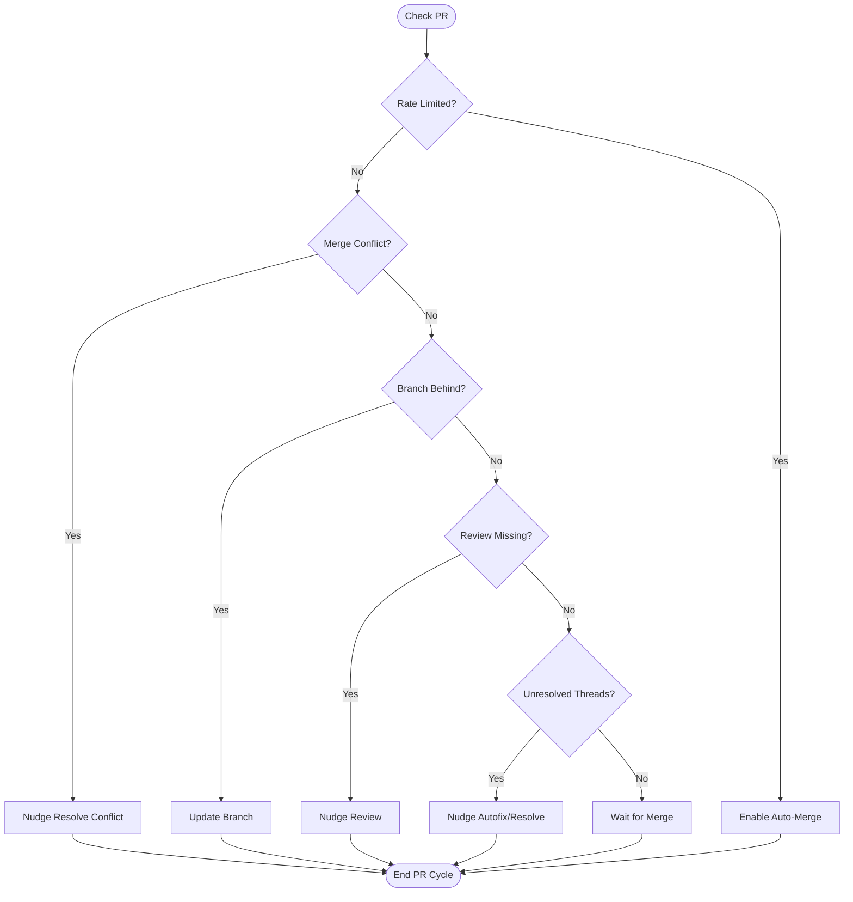
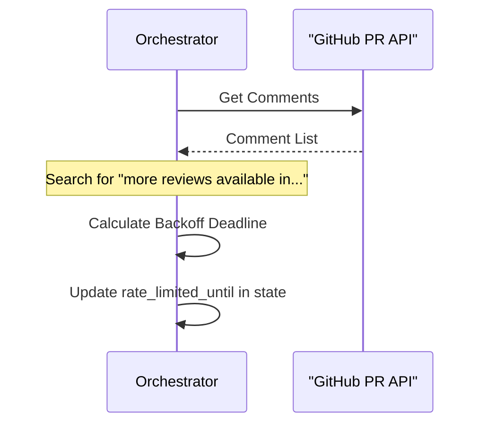

<details>
<summary>Relevant source files</summary>

The following files were used as context for generating this wiki page:

- [orchestrate.py](orchestrate.py)
- [queue-state.json](queue-state.json)
- [README.md](README.md)
- [requirements.txt](requirements.txt)
- [.github/workflows/orchestrate.yml](.github/workflows/orchestrate.yml) (referenced in documentation)
</details>

# Extending Decision Priorities

The `coderabbit-queue` system utilizes a centralized orchestrator to manage pull request (PR) interactions across multiple repositories. "Extending Decision Priorities" refers to the hierarchical logic used to determine which automated action should be taken on a PR to resolve gridlock caused by account-wide rate limits. By centralizing decision-making, the system ensures that the most critical issues, such as merge conflicts, are addressed before secondary actions like automated reviews or code fixes.

Sources: [README.md:1-15](README.md#L1-L15), [orchestrate.py:1-15](orchestrate.py#L1-L15)

## Decision Hierarchy and Priority Logic

The orchestration logic follows a strict order of operations to maximize the efficiency of the shared CodeRabbit quota. The system evaluates PRs based on their current state and applies the first applicable rule in the priority list.

### Priority Level 1: Merge Conflicts
The highest priority is given to PRs with status `CONFLICTING`. If a conflict exists, the system attempts to nudge CodeRabbit to resolve it. This action is capped to prevent infinite loops.
Sources: [orchestrate.py:382-397](orchestrate.py#L382-L397), [README.md:20-22](README.md#L20-L22)

### Priority Level 2: Outdated Branches
PRs where `mergeStateStatus` is `BEHIND` are updated to synchronize with the base branch. This creates a new commit which triggers a fresh review, effectively counting against the quota.
Sources: [orchestrate.py:402-408](orchestrate.py#L402-L408)

### Priority Level 3: Missing Reviews
If a PR lacks a CodeRabbit check or a "real" review comment, the system triggers a new review. This logic is extended to include Sentry (Seer) reviews if those checks are also missing.
Sources: [orchestrate.py:410-422](orchestrate.py#L410-L422)

### Priority Level 4: Unresolved Threads (Autofix & Resolve)
For PRs with unresolved threads, the system first attempts automated fixes. If `MAX_AUTOFIX_ATTEMPTS` is reached, it falls back to a `@resolve` command to force a "green" state by closing remaining conversations.
Sources: [orchestrate.py:424-469](orchestrate.py#L424-L469)

### Priority Level 5: Automation Maintenance
Finally, if all review requirements are met but auto-merge is disabled, the system enables it to facilitate final merging.
Sources: [orchestrate.py:473-477](orchestrate.py#L473-L477)

## Decision Flow Architecture

The following diagram illustrates the logical flow within the `process_pr` function, highlighting the priority of checks.



The diagram shows the top-down evaluation of a PR's state, where the first matching condition terminates the decision process for that specific PR in the current run.
Sources: [orchestrate.py:355-481](orchestrate.py#L355-L481)

## Key Configuration Parameters

The decision logic is governed by several constants that define thresholds for retries and cooldowns.

| Constant | Value | Description |
| :--- | :--- | :--- |
| `QUOTA_PER_HOUR` | 4 | Safety margin under the 5/hour account-wide cap. |
| `PER_PR_COOLDOWN_MINUTES` | 20 | Prevents hammering the same PR in consecutive cycles. |
| `MAX_AUTOFIX_ATTEMPTS` | 2 | Limit on automated code fix attempts before falling back. |
| `MAX_MERGE_CONFLICT_ATTEMPTS` | 2 | Limit on nudges for automated conflict resolution. |
| `MAX_CUBIC_RETRY_ATTEMPTS` | 2 | Retry limit for transient Cubic command failures. |

Sources: [orchestrate.py:56-62](orchestrate.py#L56-L62)

## State Tracking and Escalation

The system tracks every action in `queue-state.json` to ensure continuity between cron job runs. This state includes attempt counters for each PR.

```json
{
  "prs": {
    "blixten85/bastion#168": {
      "autofix_attempts": 2,
      "escalated_to_claude": true,
      "last_attempt": "2026-07-17T06:05:53.019065+00:00",
      "resolve_attempts": 1
    }
  }
}
```

Sources: [queue-state.json:20-25](queue-state.json#L20-L25)

### Escalation to Claude
When priority actions (like autofix or conflict resolution) fail repeatedly beyond their configured maximum attempts, the system performs an "Escalation." This involves adding the `ask-claude` label to the PR, which triggers an external workflow for manual/higher-level AI intervention. This is a terminal state for the orchestrator regarding that specific PR.
Sources: [orchestrate.py:317-331](orchestrate.py#L317-L331), [orchestrate.py:461-467](orchestrate.py#L461-L467)

## Rate Limit Detection Logic

The system does not just rely on its internal ledger; it also performs authoritative detection by scanning PR comments for specific patterns from CodeRabbit.



The sequence shows how the orchestrator incorporates real-time feedback from the bot itself to adjust decision priorities account-wide.
Sources: [orchestrate.py:115-135](orchestrate.py#L115-L135)

## Conclusion
Extending decision priorities in `coderabbit-queue` provides a robust framework for managing multiple automated tools within a single shared quota. By prioritizing critical blockers like merge conflicts and implementing a tiered escalation strategy, the system maintains PR velocity without exceeding external API limits.
Sources: [README.md:15-30](README.md#L15-L30), [orchestrate.py:1-15](orchestrate.py#L1-L15)
