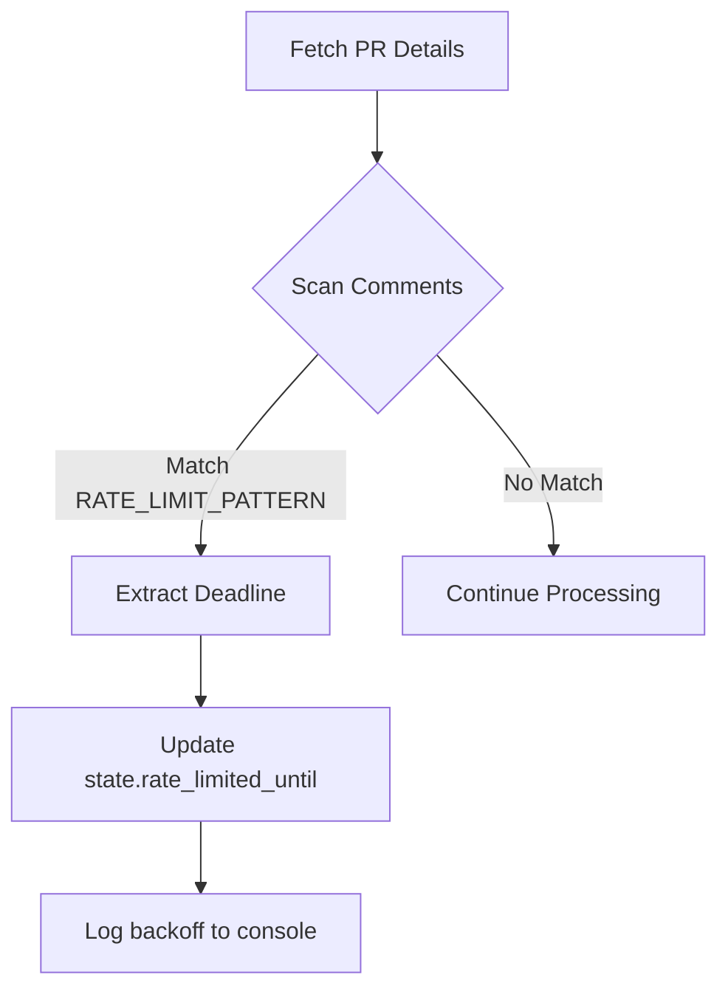
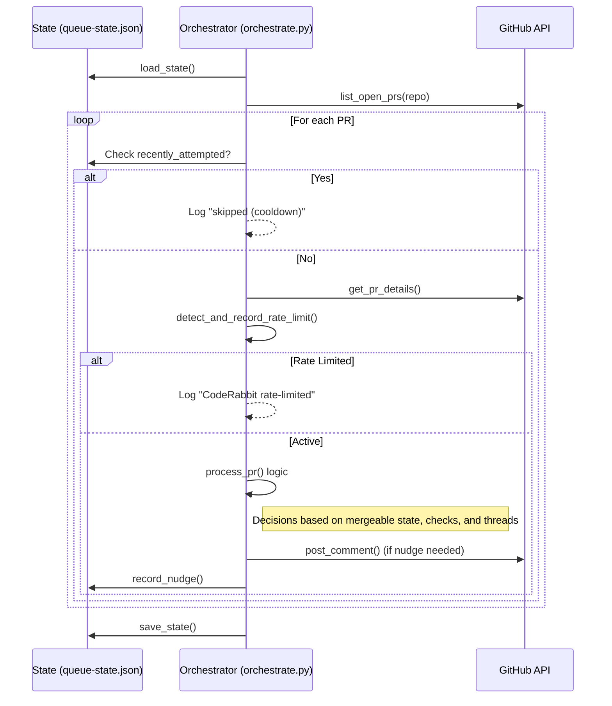

<details>
<summary>Relevant source files</summary>

The following files were used as context for generating this wiki page:

- [orchestrate.py](orchestrate.py)
- [README.md](README.md)
- [queue-state.json](queue-state.json)
- [requirements.txt](requirements.txt)
- [.github/workflows/orchestrate.yml](README.md) (Referenced via README documentation)
</details>

# Troubleshooting & Logging

The Troubleshooting and Logging system in the CodeRabbit Queue orchestrator is designed to provide high visibility into the automated "nudging" process across multiple repositories. Because the system operates within tight API quotas (5 reviews/hour), effective logging and state tracking are critical to prevent "gridlock" and ensure that Pull Request (PR) actions are processed efficiently without exceeding service limits.

The system utilizes a combination of local state persistence (`queue-state.json`), external error tracking via Sentry, and detailed console output to allow developers to monitor the health of the orchestration queue and diagnose why specific PRs may be skipped or stalled.

Sources: [README.md:1-25](README.md#L1-L25), [orchestrate.py:1-20](orchestrate.py#L1-L20)

## Sentry Integration

The orchestrator uses the `sentry-sdk` for real-time error tracking, performance monitoring, and distributed tracing. It is initialized at the start of the script execution to capture exceptions and provide telemetry for each orchestration run.

### Configuration & Tracing
The integration captures 100% of traces and profiles to ensure complete visibility into the execution flow of the `orchestrate-run` transaction.

*  **Dsn:** Loaded from the `SENTRY_DSN` environment variable.
*  **Traces Sample Rate:** 1.0 (100% of transactions).
*  **Profiling:** Enabled for continuous lifecycle monitoring.
*  **Breadcrumbs/Logs:** `enable_logs=True` allows Sentry to capture standard log output.

Sources: [orchestrate.py:32-45](orchestrate.py#L32-L45), [requirements.txt:1](requirements.txt#L1)

### Error Handling & User Feedback
The script wraps the main execution loop in a try-except block. If a crash occurs, it captures the exception to Sentry. If the script is running in an interactive terminal (TTY), it prompts the operator for manual feedback to accompany the error report.

```python
try:
    main()
except Exception as e:
    sentry_sdk.capture_exception(e)
    event_id = sentry_sdk.last_event_id()
    if event_id and sys.stdin.isatty():
        notes = input("Describe what you were doing when this failed: ")
        sentry_sdk.capture_user_feedback(...)
```

Sources: [orchestrate.py:539-555](orchestrate.py#L539-L555)

## Queue State Monitoring

The `queue-state.json` file serves as the primary diagnostic tool for understanding the current status of the account-wide quota and individual PR history.

### State Schema
The state file tracks three primary categories of data used for troubleshooting:
1.  **Nudges:** A ledger of historical actions taken, used to calculate the rolling 60-minute quota.
2.  **PRs:** Specific metadata for each Pull Request, including attempt counters for different nudge types.
3.  **Rate Limits:** Authoritative backoff deadlines received directly from CodeRabbit.

| Field | Description | Source |
| :--- | :--- | :--- |
| `nudges` | List of `{"ts", "repo", "pr", "type"}` representing sent commands. | [queue-state.json:2-24](queue-state.json#L2-L24) |
| `prs[key].last_attempt` | ISO timestamp of the last time the orchestrator acted on this PR. | [queue-state.json:27](queue-state.json#L27) |
| `prs[key].autofix_attempts` | Counter for `@coderabbitai autofix` commands sent. | [queue-state.json:30](queue-state.json#L30) |
| `prs[key].escalated_to_claude` | Boolean indicating if the PR was labeled `ask-claude` after failing auto-resolution. | [queue-state.json:35](queue-state.json#L35) |
| `rate_limited_until` | Authoritative timestamp from CodeRabbit indicating when the quota resets. | [queue-state.json:235](queue-state.json#L235) |

## Automated Troubleshooting Logic

The orchestrator includes specific logic to detect and recover from known failure modes without human intervention.

### Rate Limit Detection
Instead of relying solely on a local heuristic, the system scans PR comments for specific patterns from CodeRabbit that indicate a quota hit (e.g., "... More reviews will be available in 21 minutes.").



The system uses the `RATE_LIMIT_PATTERN` regex: `more reviews will be available in (\d+)\s*(minute|hour)s?`.
Sources: [orchestrate.py:91-94](orchestrate.py#L91-L94), [orchestrate.py:180-199](orchestrate.py#L180-L199)

### Cubic Failure Recovery
The system identifies a specific failure mode where the `cubic-dev-ai` bot crashes with an "Unknown error".
*  **Detection:** Checks if the *absolute latest* comment on a PR matches `CUBIC_COMMAND_FAILED_PATTERN` ("cubic command failed").
*  **Recovery:** If detected and `cubic_retry_attempts` is under `MAX_CUBIC_RETRY_ATTEMPTS` (default 2), it immediately re-triggers the nudge.
*  **Logging:** Logs the retry count (e.g., `retry 1/2`) to the console.

Sources: [orchestrate.py:98](orchestrate.py#L98), [orchestrate.py:202-218](orchestrate.py#L202-L218), [orchestrate.py:382-398](orchestrate.py#L382-L398)

## Execution Logs & Console Output

During a run, the orchestrator provides real-time feedback on its decision-making process. This is the primary method for troubleshooting "skipped" PRs.

### Common Log Messages
| Log Message | Meaning |
| :--- | :--- |
| `Global quota exhausted (4/hour). Stopping run early.` | The local ledger shows the budget is used up; execution halts to save the remaining PRs for the next cron cycle. |
| `skipped (nudged within last 20m)` | The PR is in its per-PR cooldown period to avoid hammering. |
| `no CodeRabbit check/review yet -> nudging review` | Initial review trigger for a new PR. |
| `unresolved thread(s) ... -> nudging autofix` | Attempting to resolve bot comments automatically. |
| `escalating to @claude (ask-claude-label)` | All automated attempts (autofix and resolve) have failed; manual/AI intervention is requested. |

Sources: [orchestrate.py:370-520](orchestrate.py#L370-L520)

## Troubleshooting Sequence
The following diagram illustrates how the orchestrator evaluates a PR and logs decisions based on the current state and PR history.



Sources: [orchestrate.py:380-530](orchestrate.py#L380-L530)

## Summary
Troubleshooting in the CodeRabbit Queue system is centered on the `orchestrate.py` script's ability to interpret GitHub PR states and manage an account-wide quota via `queue-state.json`. By integrating Sentry for runtime errors, implementing regex-based detection for external bot failures, and maintaining a strict ledger of actions, the system provides a robust framework for monitoring and diagnosing the automated review lifecycle across the repository landscape.

Sources: [README.md:10-20](README.md#L10-L20), [orchestrate.py:530-538](orchestrate.py#L530-L538)
